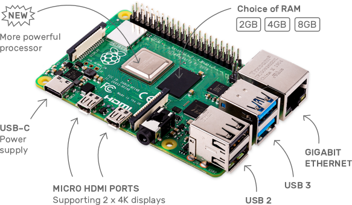
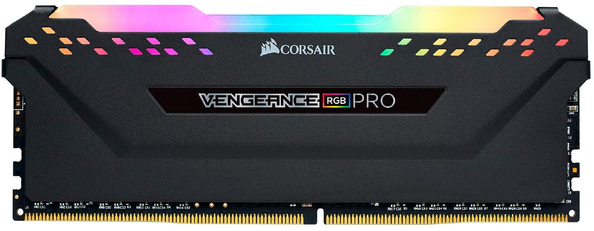

# Le processeur

Le processeur est le véritable cerveau d'un PC. Il extrait les opérations de la mémoire et les exécute. Le cycle de base est d'extraire la première opération, la décoder, l'exécuter et l'on continue pour les prochaines opérations. En anglais, CPU Central Process Unit ou encore, en français, UCT (unité centrale de traitement), Il réalise les calculs arithmétiques, les comparaisons numériques, traite et transmet des données.

Intel et AMD sont les deux principaux manufacturiers pour les processeurs d'ordinateurs de bureau, ceux de portables et ceux de serveurs. Fait à noter, ce ne sont pas les mêmes modèles de processeur qui vont équiper les différents ordinateurs (bureau, portables, serveurs), chacun ayant leur spécificité.


Alors qu'Apple, Samsung et Qualcomm le sont pour les appareils mobiles. Il est à noter que de plus en plus de manufacturiers chinois commencent à inonder le marché avec des processeurs à faible coût tels que Rockchip ou Mediatek.


Source: site de Samsung

Les processeurs actuels sont généralement petits et carrés avec plusieurs connecteurs métalliques en dessous. Les CPU se connectent à la carte-mère par l'entremise d'un socket qui permet d'y insérer le CPU. 

## Processus  

Un processus est un programme complet en cours d'exécution par un ordinateur. Il est composé d'un à plusieurs threads mais possède également plusieurs autres données tels que de la mémoire, un état, des ressources, ...

## Thread

Un thread est plus léger et fait partie du processus. Il permet l'exécution du processus. 


## Jeu d'instructions
Il s'agit de la liste d'instruction-machine que comprend un processeur en fonction du type d'architecture et du manufacturier. C'est un peu à cause de cette raison qu'un Intel x64 ne peut exécuter du code d'un ARMv7: les listes d'instructions exécutables ne sont pas les mêmes.

Deux grandes familles de jeu d'instructions :
 * le CISC (Complex Instructions Set Computer) permet plusieurs instructions, voir des centaines dans le processeur. Mais un aussi grand nombre d'instructions rendait les circuits électroniques du processeur complexe et plus les circuits sont complexes, plus long est le chemin à parcourir par le courant. Les architectures x86 et x64 se situent dans cette catégorie, cependant de nos jours, les processeurs optimisent les opérations complexes vers des opérations RISC simples.
 * le RISC (Reduced Instructions Set Computer) est une architecture permettant d'exécuter les mêmes types de tâches que l'architecture CISC, mais avec beaucoup moins d'instruction, voire moins d'une centaine. Ainsi, les circuits du processeur étaient très simplifiés et donc, beaucoup plus rapides, mais moins performants. Les processeurs ARM et SPARC se retrouvent dans cette catégorie. Ceux-ci consomment moins de courant et sont utilisés dans les téléphones mobiles.

C'est ainsi que pour des processeurs aussi rapides, les téléphones sont généralement moins performants que nos ordinateurs de bureau.

## Pipeline du processeur

C'est une technologie visant à permettre une plus grande vitesse d'exécution des instructions en parallélisant les étapes d'exécution de celle-ci. Voici les étapes du pipeline RISC (le pipeline cisc est plus complexe):

 * IF : Lecture de l'instruction (instruction fetch) charge l'instruction à partir depuis un cache CPU ;
 * ID : Décodage de l'Instruction (instruction decode) décode l'instruction et adresse les registres ;
 * EX : Exécution de l'Instruction (execute) exécute l'instruction par les unités arithmétiques et logiques ;
 * MEM : Accès mémoire (memory), écriture dans la mémoire si nécessaire ou chargement depuis la mémoire ;
 * WB : Ecriture (Write instruction) de la valeur calculée dans les registres.

Pour améliorer les performances, les concepteurs de développeurs ont depuis longtemps abandonné le modèle : extraction - décodage - exécution en séquence (une à la suite)

IF -> ID -> EX  en 3 coups d'horloge

À chaque cycle d'horloge les instructions peuvent se faire exécuter, mais ne peuvent passer du cycle IF au cycle MEM, c'est un cycle à la fois.


Chaque colonne représente un cycle d'horloge, donc au 5e cycle d'horloge, la première instruction est au cycle Write back, la deuxième au cycle mem, la troisième exécute et ainsi de suite.

En pratique, les processeurs les plus performants utilisent des pipelines extrêmement longs (de l'ordre d'une vingtaine d'étages) pour ajouter de nombreuses étapes augmentant les performances (exécution dans le désordre) et augmenter la fréquence d'horloge (moins de travail à chaque étage). (wikipédia)

Lorsque le pipeline a besoin d'une donnée qui n'est pas disponible actuellement, par exemple lors de l'exécution de ce code assembleur par exemple:

```
SUB r3,r4 -> r10     ; Soustrais r3 - r4 et enregistre sur r10
AND r10,r3 -> r11    ; Fais la comparaison binaire r10 & r3 et enregistre sur r11
```

.svg.png)

.svg.png)

## Processeurs hyperscalaires
Une autre possibilité afin d'améliorer la performance des processeurs est d'implanter plusieurs unités d'exécution (une pour l'arithmétique entière (virgule flottante) et une pour les opérations logiques) et de disposer d'un buffer d'attente. Plusieurs instructions sont lues, décodées et placées dans cette zone tampon (buffer) en attente d'être exécutées.

## Hyperthreading
La loi de Moore (Gordon Moore, développeur chez Intel dans les années 60) affirme que le nombre de transistors d'un circuit intégré double tous les 18 mois. Ce n'est pas une loi physique, mais une observation humaine.

Le hyperthreading est la façon qu'Intel virtualise ses coeurs en doublant le nombre de coeur physique en coeurs logiques.  Cette technique permet de maintenir les états de deux threads différents au niveau du processeur et ainsi de pouvoir passer de l'un à l'autre dans un laps de temps très court, de l'ordre de la nanoseconde. Ceci permet au processeur d'utiliser au mieux les ressources en garantissant que des données lui sont envoyées (s'il sait qu'une instruction doit lire un mot en mémoire, ce qui peut prendre plusieurs cycles d'horloge), une unité centrale peut passer à l'autre thread par exemple.

## Multicoeur
Au-delà du multithreading, on trouve des unités centrales possédants de deux ou quatre processeurs intégrés complets. On dit de ces circuits qu'ils sont multicoeurs. En séparant les processeurs en coeur, on a augmenté le nombre d'instructions par seconde en multipliant le nombre de traitements en parallèle. Jusqu'aux années 2005, les processeurs était simple coeur, les derniers commercialisés par Intel étaient nommés Pentium 4 et ils ont été en fin de vie dans les années 2010. On peut dire sans se tromper que mis à part les circuits intégrés, les processeurs simple coeur sont disparus.

## Cadence
La façon de déterminer la vitesse d'un processeur est par le nombre d'instructions effectuées par seconde:

Imaginons un processeur à 1 hertz, ce dernier ferait une instruction par seconde, alors qu'un processeur à 3 GHz peut exécuter 3 milliards d'opérations par seconde.

## Mode d'exécution
Les processeurs ont deux modes de fonctionnement: utilisateur ou noyau. Ce mode d'exécution est enregistré dans un des registres que nous verrons tantôt le PSW. Le mode noyau peut exécuter n'importe quelle instruction de son jeu et utiliser toutes les caractéristiques du matériel sous-jacent. Le système d'exploitation utilise le mode noyau, les applications utilisateurs le mode utilisateur. 

Pour passer d'un mode à l'autre, un programme utilisateur doit effectuer un appel système, qui bascule en mode noyau et invoque le système d'exploitation.

## Registre
Un registre est une cellule de stockage située à même un coeur du processeur. Pour cette raison, ils sont donc extrêmement rapides et permettent au coeur d'effectuer des calculs et de stocker des informations sans utiliser la mémoire centrale. La taille des registres est déterminée par l'architecture de l'ordinateur (un ordinateur 32 bits aura des registres de taille 32 bits, un ordinateur 64 bits aura des registres de taille 64 bits). Si vous ignorez ce qu'est un bit, il s'agit de la plus petite information disponible pour un PC, 1 bit représente un 1 ou un 0.

Certains registres ont un rôle très particulier :
 * le compteur de programme (PC, Program Counter), il contient l'adresse de la prochaine instruction à exécuter ;
 * le pointeur de pile (SP, Stack Pointer), c'est le pointeur d'une zone spéciale de la mémoire appelée pile où sont rangés les arguments des sous-programmes et les adresses de retour.
 * registre d'état (PSW pour Processor Status Word): décrit l'état du processeur ; il est le plus souvent interprété bit à bit, chaque bit représentant un drapeau ou état.

Lorsque l'information recherchée n'est pas dans les registres, le processeur devra se tourner vers ses caches. Ils sont généralement au nombre de trois identifié comme L1 / L2 / L3. La taille de ses registres est calculée en MB et varie selon le type de processeur.

Les niveaux vont de vitesse descendante et de taille ascendante. Donc le L1 est généralement très petit, mais excessivement rapide, L2 est plus lent et mais dispose de plus de données.

Finalement chaque coeur a accès à son propre L1 et L2, mais généralement le L3 est partagé entre tous les coeurs.

## Comment obtenir toute l'information des processeurs?
Dans la page de présentation du processeur (que ce soit Intel ou AMD), nous pouvons voir les spécificités

https://ark.intel.com/content/www/us/en/ark/products/199335/intel-core-i7-10700k-processor-16m-cache-up-to-5-10-ghz.html:

Par exemple, le i7-10700K a:
* 8 coeurs physiques
* 16 coeurs logiques (donc hyperthreading)
* Socket: Comet Lake
* Dimension: 14nm
*  Vitesse : 3.8 Ghz (vitesse de chacun des coeurs)
* Cache: 16Mb

Nos téléphones cellulaires sont équipés de multiples coeurs également, par exemple le A13 d'Apple possède: 2 coeurs gourmands et 4 coeurs économes permettant de transiter entre les deux modes de fonctionnement afin d'économiser la batterie alors que le Exynos 2200 de Samsung possède 7 coeurs (1 performant, 3 moyens et 4 économes en énergie) afin de toujours transiter entre performance et consommation électrique.

## En tant que développeur
Les notions importantes à savoir sont les suivantes:
* Si vous créez un programme et que vous souhaitez qu'il utilise plus de "coeurs", vous devrez le coder en ce sens. Par défaut, un programme ne s'exécute que sur un coeur.
* Le système d'exploitation gère l'assignation des opérations à faire au processeur. Votre programme peut se faire interrompre n'importe quand.

# Carte-mère
L'élément constitutif principal de l'ordinateur personnel est la carte-mère, aussi appelée « Motherboard » ou « Mainboard ». La carte mère d'un PC contient une multitude de circuits intégrés et chacun de ces circuits joue un rôle particulier. 

C'est sur cette carte que l'on connecte le processeur, la mémoire RAM (mémoire centrale), les disques durs ou ssd et la carte graphique. Il est à noter que chaque carte-mère est différente, elle peut supporter qu'un certain chipset de CPU par l'entremise du type de socket utilisé.


## Ports 
Les ports à l'arrière de la carte-mère sont: 
* USB (2/3 bleu)
* réseau (interface RJ-45)
* Sortie son et Microphone
* HDMI

## Fentes d'extension
* PCI Express: Généralement les cartes graphiques utilisent la ou les fentes d'extensions principales. Les fentes d'extension 1X peuvent être utilisé à d'autres fins: réseau, SATA, RAID, Wi-Fi, SSD).
* SATA: Généralement utilisé pour les unités de stockage

Bien que l'on parle généralement de carte-mère pour les ordinateurs de bureaux principalement, tous les appareils ont un carte-mère que ce soit cellulaire, tablette, portable qui agiront tel une carte-mère. La principale distinction est que pour ces appareils miniatures, les éléments sont soudés directement dessus:



Comme vous le voyez ici, un raspberry pi est un ordinateur qui tient sur une petite carte de taille (carte de crédit). Il est généralement utilisé dans les projets de DIY (do it yourself) d'automatisation. Une carte SD ou une clé USB peut être utilisé pour stocker le système d'exploitation.

## Chipset
Un chipset est un élément de la carte-mère qui permet de communiquer avec le processeur.

Comme nous le démontre le schéma suivant:

.png)

Comprenez que ce qui nécessite une grande vitesse sera directement gérée par le processeur alors que ce qui nécessite moins de vitesse passerons par le socket (carte-mère). Avec ce schéma, le processeur communique directement avec la mémoire centrale RAM, le PCI Express ou SSD et le Display Port / HDMI. Lorsque la vitesse n'est pas nécessaire, nous utilisons le chipset soit pour :
* le son 
* les ports SATA 
* les ports USB
* le réseau ethernet ou wifi
* les ports PCI Ex 1x moins rapide.

On voit la présence de deux sections pour les fentes d'extension PCI Express, deux choses influencent ce comportement. Premièrement, le type de connexion PCI Ex (par exemple une carte graphique c'est généralement 16x, occupe une fente 16x pci.ex). Il y a des fentes 16X, 8X, 4X et 1X:


Cependant,  dépendamment des CPUs, ils supporteront un nombre variable de voies PCI Ex, comme dans le haut du document on voit soit 1x 16x ou 2x 8x ou 1x 8x + 2x 4x. Ceci indique que le nombre simultanée de connexion en même temps sur toutes les voies PCI ex est 16x. Si vous placez deux cartes vidéos, elles auront chacune 8X de voie chacune (donc performeront moins rapidement). 

Ceci sont des voies CPU donc plus rapides que celles offertes par le Chipset, on voit d'ailleurs leur vitesse maximales de 8 Gb/s. Souvent un port M.2 est donné également une vitesse de 4x PCI Ex afin d'obtenir les vitesses rapides que l'on voit attribué au port M.2.

Du côté AMD, le diagramme est relativement similaire:


Le chipset ici est le X570 chez AMD qui communique avec les processeurs Matisse de la série 3000.

Finalement, l'emplacement de la carte-mère où l'on insère le processeur est nommé socle (ou socket en anglais). 

Vous comprendrez que lorsque vous assemblez un ordinateur, vous devrez vous assurer que le socle (socket) soit compatible avec votre processeur.

### BUS
Un bus est une route entre deux éléments, entre le processeur et la mémoire centrale, un bus, entre le socket et le USB, un bus. À l'origine des ordinateurs, un seul bus était utilisé, mais avec l'augmentation des performances (tant de la communication avec E/S qu'avec la communication entre processeur et mémoire), nous nous sommes tournées vers des bus de plus en plus rapides. Comme nous le voyons dans les graphiques précédents, les bus sont présents sont le DMI et le SPI.

De nos jours, les bus ont été remplacés par des technologies plus rapides et plus larges tel que Intel QPI, DMI, AMD Infinity Fabric.

# Mémoire vive
Le processeur, comme mentionné précédemment, effectue les calculs et traite les données. Mais celui-ci ne peut pas emmagasiner l'information... il ne peut utiliser les registres que comme cache temporaire.



## Qui s'occupe de contenir la mémoire des programmes?
La mémoire centrale ou mémoire RAM (Random Access Memory), mémoire à accès aléatoire, ou souvent appelée « mémoire vive ». Il s'agit en fait de mémoire temporaire pour les données. Elle nécessite constamment un courant électrique sinon lorsque le PC est mis hors tension, tout le contenu de la mémoire RAM est remis à zéro.

Chaque fois qu'un programme est exécuté sur un PC, celui-ci est emmagasiné dans la mémoire vive puis traité par le processeur. Nous verrons pourtant qu'il existe de la mémoire de stockage sous plusieurs formes.

## Pourquoi avons-nous donc besoin de mémoire centrale?
Il s'agit d'une question de rapidité. La mémoire de stockage est réputée pour son utilité, mais aussi pour sa lenteur. En appliquant la loi du troupeau, les éléments d'un PC interagissent entre eux et la vitesse des échanges est déterminée par la composante la plus lente. Le processeur étant extrêmement rapide, il est donc préférable de l'utiliser avec une composante des plus rapides.

La DDR est un type de mémoire SDRAM qui double la vitesse de la SDRAM en permettant un échange de données au début et à la fin de l'horloge (lorsque le signal est à 0 et à 1). Les versions de DDR varient de DDR2 à DDR4 offrant de plus en plus de vitesse pour chaque nouvelle version. Nous sommes rendus à la 4e version de la DDR de nos jours.

# GPU
Le gpu ou carte vidéo (graphique) ou graphic processing unit est une carte d'extension permettant de générer une image sur un écran. Certains processeurs ont une carte vidéo intégrée, c'est le cas de la majorité des processeurs intel résidentiels, donc lors de l'assemblage d'ordinateur à processeurs Intel, il n'est pas nécessaire de se procurer absolument une carte graphique. Bien sûr que les cartes graphiques intégrées ne sont pas au même niveau que les cartes graphiques externes lorsqu'on parle de performance dans les jeux vidéos, mais pour un usage traditionnel, ils sont malgré tout performants.


Présentement il y a deux manufacturiers principaux pour les ordinateurs de bureau ou portable: Nvidia et AMD. Du côté mobile, Qualcomm (Adreno) et Nvidia proposent des GPU pour les mobiles (cellulaire et tablettes). Les chinois ont des GPU également, Mali. Du côté libre, VideoCore de Broadcom équipe le Raspberry PI.

Afin de générer ou manipuler des images à afficher sur un écran. Leur unité de calcul leur permet de calculer en parallèle un grand nombre d'unités ce qui les rend plus rapides que leur confrère CPU dans plusieurs tâches.

Les ordinateurs portables utilisent plusieurs GPU, un qui sera intégré au processeur pour une question d'économie d'énergie et s'occupera des calculs 2D et une plus performante, externe qui sera rattachée au système et qui s'occupera du calcul 3D, mais qui viendra avec sa consommation électrique plus élevée.

Le GPU possède également de la mémoire vive sur la carte, permettant ainsi au processeur graphique de faire ses calculs. Certaines cartes vont venir avec de la DDR traditionnelle alors que d'autres vont bénéficier de GDDR.

La différence entre les deux est que la GDDR est utilisée pour transporter de large quantité de données en simultanées grâce à un bus de données plus large (entre le GPU et la mémoire RAM sur la carte vidéo).

Dernièrement, une grande portion de la consommation électrique d'un ordinateur provient de la carte graphique, certaines fois une simple modification de la carte graphique occasionne un changement du Power Supply.

# Power Supply
Le power supply est le convertisseur de courant entre le courant alternatif provenant du mur, vers du courant continue utilisé pour alimenter les différentes portions de l'ordinateur. Il est à noter qu'il existe 3 types de power supply:

Modulaire


Semi-modulaire


et non modulaire


Vous aurez compris que la différence vient du fait à savoir si vous avez ou non des fils intégrés.

Une autre différence primordiale dans le choix des Power Supply sont les standardisations de la qualité du power supply:

Cela varie entre:
* 80 PLUS
* 80 PLUS Bronze
* 80 PLUS Silver
* 80 PLUS Gold
* 80 PLUS Platine
* 80 PLUS Titane


source: https://www.velocitymicro.com/blog/what-is-psu-efficiency-and-why-is-it-important/

### Qu'est-ce que ceci implique? 

Les power supply ne sont pas parfaits, i-e dans leur transformation du courant alternatif vers le courant continu, il y a une perte. Ainsi, plus qu'un power supply est de qualité (modèle titane ou platine), moins que cette perte est grande. De plus, plus vous êtes proches de la limite 100% d'utilisation , plus vous perdez de l'efficacité. Donc il est important lors de vos conceptions d'ordinateur, de garder un tampon d'alimentation pour que votre consommation soit entre 40% et 60%. Ceci permettra d'ajouter ou de modifier les éléments de l'ordinateur sans risquer de se rendre à la capacité limite. Il faut aussi faire attention avec votre choix de power supply, c'est lui qui protège le reste des pièces de votre ordinateur et peut-être même utiliser un UPS.


# Unité de stockage
Vient en plusieurs saveurs, voyons en ordre de taille:


## Disque dur rotatif

Nommé en anglais HDD (hard disk drive), vieillissant mais toujours disponible, il s'agit des disques à plateaux que les données sont inscrites sur les différents plateau ou disques dans leur boîtier hermétique. 


Nous reviendrons en détail sur ce petit appareil lors du chapitre sur les unités de stockage et système de fichiers, mais il est important de savoir que certaines informations sont nécessaires afin de choisir le bon disque dur pour notre système (toujours si vous avez besoin d'enregistrer une grande quantité d'information) ou que vous ne disposez pas des moyens pour vous procurer des SSD de grande capacité. 

### Taille
La taille du disque dur va impacter sur la vitesse de rotation. Les disques durs de taille 3.5" sont plus orientés vers les ordinateurs de bureau. Alors que les disques 2.5" seront orientés pour les ordinateurs portables.

### Vitesse de rotation
La vitesse de rotation d'un disque dur se calcule de la même façon qu'un moteur de voiture c'est à dire, en RPM, en rotation par minute. Plus la viExplicationtesse est grande, plus la lecture de données risque de se faire rapidement. Plus le disque est grand (3.5"), plus ses RPMs pourraient être élevés.

### Temps d'accès
Le temps d'accès aux données consiste au temps que prend la tête de lecture pour atteindre la bonne piste. Ce temps se compte en millisecondes.

### Taux de transfert
Le taux de transfert est le nombre de données par seconde qui peuvent être transférées entre le disque dur et l'ordinateur par le biais de son interface.

### Benchmark

Si vous souhaitez en savoir un peu plus sur les capacités de vos disques, déterminez s'ils vont à pleine capacité ou non, vous pouvez toujours vous tourner vers le logiciel: CrystalDiskMark.

https://crystalmark.info/


### Exemple

https://www.staples.ca/products/2465942-en-seagate-barracuda-2-tb-desktop-internal-hard-drive-sata-6gbs-35

Plusieurs éléments à noter ici:

Vous pourrez voir les réelles spécifications sur le site web du manufacturier: https://www.seagate.com/ca/en/internal-hard-drives/hdd/barracuda/#specs-3-5.

Même si on affiche des possibilités de 6 GBps sur la page du de Staples, il s'agit en réalité d'une erreur de retranscription et en plus erronée de la valeur théorique pour le port SATA III et non pour le disque dur. 

En réalité, lorsque vous regardez les spécifications selon le pdf de Seagate ce sera sous les 200 MBps. Ce qui, malgré tout, pour un disque dur rotatif est bon.

## Bulle d'explication

La différence entre GBps et Gbps est relativement difficile à percevoir au début. En gros, nous verrons ça en détail plus tard, mais comprenez actuellement que la différence est causé par la langue:

* 1 bit représente une donnée variant entre 0 et 1. 
* Si vous collez 8 bits ensemble, vous obtenez un octet (ou un **Byte** en anglais). 
* Donc 8 bits = 1 Byte, la différence entre 6 Gbps (bits) et 6 GBps (bytes) est la division par 8. 
* Donc 6 GBps escomme
Le calcul de votre vitesse Internet peut être approximativement identique, si vous avez un accès Internet à 100 Mbps, vous téléchargerez approximativement un fichier de 1 GB en 2 minutes:

* Fichier de 1GB
* Vitesse de 100 Mbps ou 12.5 MBps
* 1000 / 12.5 = 80 secondes ou 1 minute 20

## SSD
Un SSD (Solid State Drive) est une unité de mémoire auxiliaire qui utilise des circuits électroniques pour stocker l'information. La technologie SSD utilise des interfaces électroniques afin d'être compatible avec les technologies des disques durs traditionnels ce qui permet aisément de les remplacer. De plus, ils utilisent les mêmes connexions SATA. Finalement, à la base ils utilisent des NAND afin de stocker l'information.


Les SSDs n'ont pas de composantes mobiles ce qui les distingues par rapport aux disques durs et disquettes.

Comparativement à ses disques:
* plus résistants aux chocs (moins de risque d'abimer le plateau)
* plus silencieux (aucune pièce mécanique rotative)
* temps d'accès plus bas (temps avant d'obtenir la donnée)
* plus coûteux pour une grande quantitée

Le temps de lecture et le temps d'écriture ne sont pas les mêmes pour tous les SSDs.

Il faut savoir qu'il y a deux façons deux façons de connecter les SSDs:

## SATA

Les 870 (SATA) ont une vitesse de lecture de 550 MBps et de lecture de 520 MBps.

## M.2 ou NVME

Des disques durs utilisant les voies PCI Ex, pour communiquer avec le CPU:


Entre les deux choix, les M.2 sont plus rapides (jusqu'à 3500 MB/s de lecture et 3300 MB/s d'écriture)

Bien sûr, que pour utiliser l'une ou l'autre des deux technologies, vous devez valider le nombre de port SATA ou M.2 disponible sur votre carte-mère. Lorsque vous songez à acheter un nouvel ordinateur, prenez le temps de bien choisir la carte-mère.

## Clé USB

Une clé USB contient une mémoire flash et ne possède pas ou très peu d'éléments mécaniques, ce qui la rend très résistante aux chocs. Elle est idéale pour le transport des données, mais peu applicables comme solutions de backups. Étant donné que vous étudiez en informatique, vous devriez vous tournez vers des solutions en ligne tel que https://github.com/ ou https://about.gitlab.com/ pour votre code, sinon tournez-vous (pas concrètement) vers des solutions en ligne pour vos documents tel que google drive ou microsoft one drive (où graçe à votre accès étudiant, vous avez accès à 1 TB).

Les clés USB peuvent être utilisé comme système d'exploitation sur un Raspberry PI, mais généralement il y a une limite de lecture / d'écriture: en revanche, le nombre d'écritures sur une clé USB étant techniquement limité (10 000 à 100 000 selon la technologie de réalisation des cellules) (Selon Wikipedia)

Carte SD
Les cartes SD sont utilisées pour le stockage de fichiers dans les appareils photo numériques, les caméscopes numériques, les systèmes de navigation GPS, les consoles de jeux vidéo, les téléphones mobiles dont les smartphones, ou encore les systèmes embarqués. (wikipedia)


Elles sont néanmoins souvent utilisés dans l'informatique embarquée vu qu'elle se formate et s'insère facilement dans les appareils contrairement aux clé usbs qui en ressortent fortement.


# Schématisation logique du fonctionnement d'un ordinateur

.png)


Ici une petite représentation sur comment fonctionne un ordinateur.

## Unités d'entrées

* Clavier
* Souris
* Microphone
* Écran tactile

## Unités de sortie

* Haut-Parleur
* Écran / tactile
* Imprimante

## Unité de stockage

* SSD
* Disque dur
* Clé USB
* Carte SD

## Mémoire centrale

La mémoire centrale contient les applications et le système d'exploitation. C'est elle qui gère le lancement, l'exécution et la sortie des programmes.

## Mise en situation

Exécution de l'application Excel (imaginons qu'il n'est pas en exécution actuellement):

* La souris est utilisée pour cliquer sur l'application excel dans la barre des tâches (lecture)
* Le logiciel doit être chargée du disque (car elle doit être chargée en mémoire centrale)
* Le logiciel est exécuté par le processeur et est retournée en tant qu'application
* L'application est affichée par l'entremise du moniteur
* On modifie le document:
  * Les unités d'entrées (clavier souris) occassionnent des lectures en mémoire centrale
  * Les données sont modifiées en mémoire centrale et mises à jour par l'entremise du processeur (pour s'assurer de l'intégrité des données)
  * Les données sont affichées par le moniteur
* On sauvegarde le document ( L'utilisateur appuie sur le raccourci-clavier Ctrl-S )
* La mémoire lit l'information du clavier et sauvegarde le fichier sur une unité de stockage

# Ergonomie

La bonne disposition devant son ordinateur nous permet de travailler plus longtemps, sans problème d'inconfort à long terme. Prenez le temps de bien lire le document surtout que vous risquez de vous retrouver plusieurs heures par jour assis devant votre ordinateur. Ceci est matière pour le cours.

[Lire le document](pdf/ergonomie_CSST.pdf)