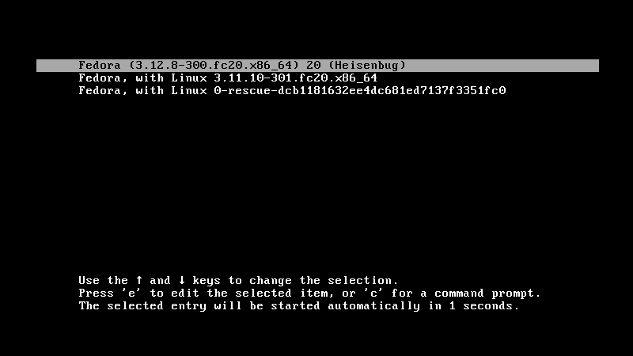
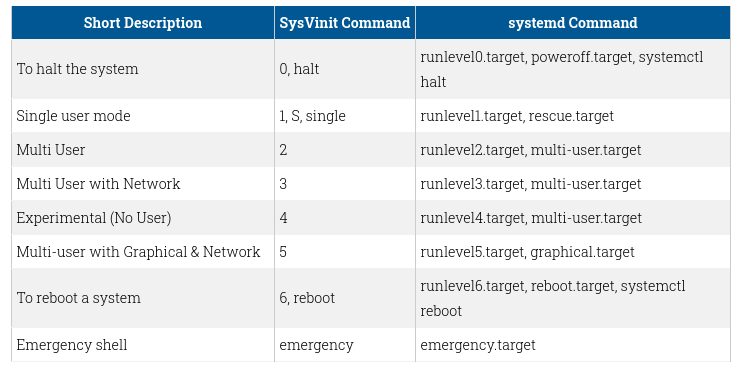

# Démarrage de l'ordinateur

Pour plusieurs, le démarrage c'est ça:


Pourquoi le bouton "Power" est-il représenté par un tel signe ?

Mais il y a plus à savoir et surtout à gérer lorsque vous vous occupez de plusieurs serveurs ou ordinateurs.

**Dans un système informatique, un firmware (ou micrologiciel, logiciel embarqué ou encore microprogramme) est un programme intégré dans un matériel informatique (ordinateur, photocopieur, automate (API, APS), disque dur, routeur, appareil photo numérique, etc.) pour qu'il puisse fonctionner.**

L'UEFI est la spécification qui spécifie une interface logicielle entre le système et le matériel. UEFI remplace le BIOS et prend en charge les services que s'occupait le BIOS. L'UEFI et le BIOS sont des firmwares qui permettent de communiquer avec le matériel de façon très limitée.

Ce qu'il faut comprendre ici entre le BIOS et le UEFI: le BIOS utilise le système MBR comme table de partitionnement, alors que le UEFI utilise le GPT avec une partition EFI (vous avez vu la différence dans le TP).

## Les étapes de démarrage

1. Le code contenu à l'intérieur du firmware est chargé en mémoire afin d'être exécuté. Celui-ci effectuera quelques tests sur le matériel (mémoire, disques et ports d'entrée/sortie, etc). Ce test se nomme POST (power-on self test). Lors d'erreur des codes signaux audios sont utilisés afin de permettre d'identifier la source de l'erreur si l'écran est non-disponible.

1. Le firmware connaît la façon de communiquer de base avec les périphériques souvent de façon très limitative tel que le clavier, la souris ou l'écran.  Il détermine par sa configuration quel partition du disque dur (ou ssd) avec lequel démarré le système. 

1. Il serait possible de changer le disque de démarrage par l'entremise d'une touche de raccourci lors du démarrage, dépendamment du manufacturier de l'ordinateur cela peut changer, il n'y a pas de normes fixes (delete, F11 ou F12 ou F2)

### Compatibilité BIOS 

* Le firmware lit les infos du premier secteur du disque de démarrage, le MBR, qui contient les informations des différentes partitions.

* Le BIOS ne connaît rien par rapport aux systèmes d'exploitation, il ne peut savoir s'il s'agit d'un GNU/Linux ou d'un Windows. Il ne sait que lire l'information du MBR et d'en exécuter le code à partir de là. Même si le BIOS prend en charge les communications initiales avec les périphériques, le système d'exploitation viendra communiquer directement aux périphériques lorsqu'il aura remplacé le BIOS en mémoire centrale, après le chargement du noyau du OS.

### UEFI

Sensiblement les mêmes étapes que le MBR mais avec quelques nouveautés:

* Le test POST (du démarrage) et initialisation du matériel pour le démarrage.
* Recherche des entrées de démarrage dans la partition système EFI des différents disques de l'ordinateur.
* Lancement de l'application EFI qui permet deux choix à l'intérieur de la partition EFI:
  * EFISTUB permettant de charger un noyau directement à partir de l'application EFI de UEFI
  * Charger une application tel que GRUB, rEFind ou Windows Boot Manager qui permettra de choisir le OS à booter.  

* Si le paramètre Secure Boot est activé dans la configuration UEFI, le processus de démarrage vérifiera l'authenticité du EFI par sa signature et pourra empêcher toute modification par l'utilisateur. Secure Boot est une technologie où le firmware (UEFI) vérifie que le chargeur d'amorce est signé par une clé cryptographique dans une base de donnée contenue dans le firmware. Seules les signatures vérifiées permettront le chargement du chargeur d'amorce: grub ou le noyau EFISTUB. 

# Chargeur d'amorce

GNU GRUB (pour GNU GRand Unified Bootloader) est un chargeur d'amorce libre provenant de GNU. Il permet le multiboot et permet d'envoyer des commandes en ligne de commande au noyau.



## Grub

Le mini logiciel grub est installé dans le MBR ou le EFI, ce dernier va rechercher dans les différentes partitions le répertoire nommé /boot contenant la configuration de grub.  Si vous installez un Linux à domicile, ce dernier s'occupera à démarrer Windows en appelant le programme winload.exe de votre partition Windows lors du dual boot.

Le fichier principal de la configuration de grub se situe dans le répertoire /boot/grub/grub.cfg, c'est un fichier auto-généré par le logiciel grub et qui permet d'indiquer à grub l'emplacement des différents systèmes d'exploitation disponible sur l'ordinateur.

En gros, ce fichier permet d'afficher le menu au démarrage de l'ordinateur. On proscrit généralement la modification de ce fichier à la main, car il a été créé par le logiciel: grub-mkconfig et lors mises à jour de grub, celles-ci écraseront vos modifications. Si vous souhaitez modifier certains paramètres de configurations de grub, vous devrez modifier le fichier /etc/default/grub (sous debian) qui contient les configurations modifiables par défaut de grub, comme par exemple:
* le système d'exploitation par défaut
* le temps disponible afin de changer le choix du système à utiliser lors du démarrage

Lorsque ces configurations activées, utilisez cette commande afin de mettre à jour le fichier /boot/grub/grub.cfg

```
grub-mkconfig -o /boot/grub/grub.cfg
```

Grub peut être utilisé sur une partition MBR en utilisant la commande suivante:
```
grub-install /dev/sda
```
ou sur une partition EFI:

```
grub-install --target=x86_64-efi --efi-directory=/boot --bootloader-id=GRUB
```

**/boot est le répertoire monté de la partition efi**

Assurez-vous que le fichier a bien été créé après la commande, car s'il est vide et que vous redémarrer votre système ne pourra pas démarrer. Grub n'est pas le seul logiciel d'amorce existant:

* Opencore / Clover: bootloader utile pour un hackintosh
* REfind : bootloader pour un vrai macintosh si vous souhaitez dual booté avec Linux
* Windows a son propre bootloader séparé en 3 parties: Windows Boot Manager (Bootmgr), Windows operating system loader (Winload.exe) et Windows resume loader (Winresume.exe).
* boot0 : pour BSD

## initrd

Dans certaines situations, il sera nécessaire de charger un ramdisk nommé généralement initrd (init ramdisk). Le initrd est un système de fichier racine monté avant que le véritable système de fichier racine soit disponible. L'image initrd est lié au noyau et est chargé directement en même temps qu'on charage le noyau. L'avantage est de permettre le chargement de certains modules permettant certaines fonctionnalités:

* Partition racine encryptée
* LVM
* NFS
* RAID

L'avantage principal est d'éviter d'ajouter des modules dans le noyau lors de sa compilation qui ne sont utilisés que pour charger la partition racine. 

# Démarrage sous Windows

Sous Windows, la première étape est de charger le Windows Boot Manager qui permettra dans une installation multiple Windows de charger le bon système d'exploitation (vous pourriez avoir un Windows 7 et un Windows 11 installé sur le même ordinateur). Par la suite, Windows Boot Manager s'occupe de charger winload.

À ce stade, le code contenu dans le secteur de démarrage est exécuté et le contrôle du processus de démarrage est octroyé au Gestionnaire de démarrage Windows (BOOTMGR). Le Gestionnaire de démarrage Windows (BOOTMGR) contrôle plusieurs étapes du démarrage :

* WinLoad (WINLOAD.EXE) utilise le chemin indiqué dans le BOOTMGR pour trouver la partition de démarrage.
* WinLoad charge deux fichiers constituant le coeur de Windows, à savoir NTOSKRNL.EXE (noyau) et HAL.DLL (interface abstraite).
* WinLoad lit les fichiers du Registre, choisit un profil matériel et charge les pilotes des périphériques.

Il démarre le fichier d'ouverture de session appelé WINLOGON.EXE et affiche l'écran d'accueil de Windows.

# Démarrage sous Linux

1. Le noyau se fait chargé et démarré par le chargeur d'amorce (grub).
1. Le matériel est détecté au fur et une interface abstraite est offerte aux utilisateurs ou applications tentant de communiquant avec lui.
1. Pour voir le matériel détecté au démarrage, vous pouvez utiliser les deux commandes suivantes qui retournent sensiblement le même résultat:
   * dmesg
   * journalctl -b [offset] 
    (offset : -1 pour le dernier boot (pas celui en cours))

        Ça défile très rapidement, n'hésitez pas à envoyer le résultat à l'intérieur de less afin de voir page par page:

        ```
        dmesg | less
        ```

## Qu'est-ce qu'on veut dire par une interface abstraite ou HAL?

Il s'agit d'une façon de présenter l'information à l'utilisateur, une façon de communiquer avec le matériel différente mais qui n'aura aucun impact pour l'utilisateur. Par exemple, lorsque vous naviguez dans les systèmes de fichiers, ils répondent tous par les mêmes possibilités de ls, cd, mkdir, ln, rmdir, ... Ils présentent donc tous la même interface de contrôle même si en arrière, la façon de structurer les données dans le système de fichier est différente pour chacun d'entre eux.

Il est aussi possible que deux claviers agissent différemment et envoient des signaux non identiques, mais l'interface présenté aux utilisateurs sera la même. Un autre exemple d'abstraction réalisée est au niveau du CPU, chaque CPU a son propre jeu d'instructions, mais le compilateur va toujours optimiser le code pour le CPU sur lequel on l'exécute (à moins de faire du cross-compiling).

L'abstraction matérielle permet au développeur de développer des applications indépendantes du matériel en utilisant des appels haut niveau du système d'exploitation. 

Même si cela semble trivial en 2023, au début de l'ère informatique, les premières versions de Windows ne supportaient pas ceci, tu devais choisir la version de Windows en fonction de l'architecture de ton CPU (386, 486, ...).

## Udev

Même si le concept de HAL demeure sur GNU/Linux, il est disparu en 2010 pour devenir udev. Udev est un userspace device system qui permet aux usagers d'effectuer des opérations en recevant des messages des devices.

# init

Finalement, après la détection du matériel, le noyau exécute le processus du système d'exploitation: init. C'est le premier processus du système d'exploitation qui permet de charger le reste des processus système et de lancer un système de connexion au système (login).

Init est un processus service qui s'exécutera tant que l'ordinateur ne sera pas fermé. Il est le parent de tous les processus exécutés par l'ordinateur. Il y aura une panique de noyau si le noyau n'arrive pas à démarrer ce processus à la fin de son chargement. Longtemps, init était offert par l'entremise du programme sysvinit qui était le logiciel d'initialisation du système d'exploitation Linux, il provenait de UNIX System V (au début des années 1980). 



La majorité des systèmes d'exploitation Linux ont migré vers la solution systemd (qui fournit également le processus init), mais systemd englobe beaucoup plus de fonctionnalités:
* Il s'exécute en parallèle
* Il résout automatiquement les dépendances (si un service y a besoin du service x avant de s'exécuter, il va démarrer x et après y).
* Il peut relancer des processus
* Il peut enregistrer les logs d'exécutions

Voici les commandes principales de systemd
| Action                                              | Commande                       |
| --------------------------------------------------- | ------------------------------ |
| Démarrer un service                                 | systemd start service          |
| Arrêter un service                                  | systemd stop service           |
| Redémarrer un service                               | systemd restart service        |
| Recharger les configurations d'un service           | systemd condrestart service    |
| Redémarrer le service s'il est en cours d'exécution | systemd condrestart service    |
| Statut d'un service                                 | systemd status service         |
| Activer au démarrage                                | systemd enable service         |
| Désactiver au démarrage                             | systemd disable service        |
| Valider si un service démarre au démarrage          | systemd is-enabled service     |
| Mettre à jour les configurations                    | systemctl daemon-reload        |
| Statistiques de démarrage                           | systemd-analyze                |
| Lister les services lents au démarrage              | systemd-analyze blame          |
| Analyser les dépendances lentes                     | systemd-analyze critical-chain |

# Kernel panic (Écran bleu Windows)

Une panique du noyau nommé Kernel Panic est une mesure de sécurité prise par le noyau lorsqu'il détecte une situation qu'il serait incapable de résoudre ou incapable de continuer à s'exécuter sans un risque élevé de perdre les données ou de les corrompre.

Si un noyau tente de lancer le processus /sbin/init et n'y arrive pas, il va paniquer ;)