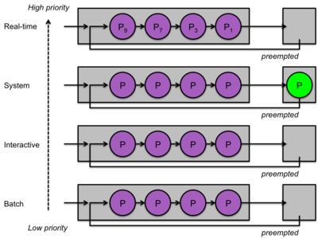

# Noyau et processus

## Les tâches du noyau

Les applications sont des programmes distincts du système d'exploitation et même si certaines applications sont livrées avec celui-ci, le système d'exploitation réside principalement dans ce que l'on nomme le noyau (kernel).

Les principaux rôles du noyau sont les suivants:
* Gestion du matériel par l'entremise des pilotes (Windows) ou des modules (Linux)
* Gestion des processus
* Gestion de la mémoire RAM
* Gestion des entrées et sorties

# Structure d'une description de processus

Une structure PCB, process control block, contient les information suivantes:
* Un identifiant processus 
* Un état de processus
* Contexte processus (les valeurs des registres afin de pouvoir recommencer où il était rendu)
* Mémoire virtuelle
* Ressources (image, son, fichier, réseau, ...)
* Données d'ordonnancement, priorité
* Un ou plusieurs fils d'exécution

Lors de la présence d'un seul fil d'exécution, c'est un processus nommé **processus lourd**. Ce que vous avez codé à date se situe dans cette catégorie. Il n'y a qu'un processus et à l'intérieur le seul fil (code) que vous avez codé. 

Lors de la présence de plus d'un fils d'exécution, ceux-ci sont nommés **processus léger**. Chacun de ces fils d'exécution a leur propre valeur de registres et sa propre pile d'exécution privée:
* L'avantage principal est lors de changement d'exécution dans le processus: ça ne consiste que de changer de pile et de passer d'une pile d'exécution à une autre tout en conservant le contexte mémoire. La même mémoire est donc partagé entre tous les fils qui s'exécutent en simultanée.
* L'opération de création de nouveau fil d'exécution est également simple car elle ne nécessite pas la duplication du processus parent.

Tout le système Linux repose sur le concept de fils et sur le concept de processus parent et processus fils:
* Le premier processus créé est un fil noyau, nommé processus 0, créé par la fonction start_kernel, met en route les structures de données du noyau, autorise les interruptions puis crée un second fil: le processus 1, init. Le processus 0 s'endort pour n'être réveillé que lorsqu'aucun autre processus ne s'exécute.
* Le fil init, nommé processus 1, crée 4 autres fils: 2 pour gérer le cache disque , et 2 pour le swap. Finalement le fil init devient le processus init en appelant la méthode execve.
* Le processus init va donc créer à son tour un certain nombre de processus: surveillance du réseau (inetd), gestion des imprimantes (lpd), gestion des terminaux (getty), ...

## Exécution d'un processus

Le processus passe par différents états:
* Initialisé: Le processus vient d'être créé, il ne peut pas être prêt tant que cette étape n'est pas complétée par le noyau. La mémoire se fait d'ailleurs allouée à cette étape.
* Prêt: Il est en attente d'être élu lors de la prochaine Élection.
* Élu (R): Il est en exécution.
* Bloqué (D): Lorsqu'il est en exécution, il peut se retrouver en attente de l'ouverture d'un fichier et donc se retrouve dans cet état suite à un blocage. Lorsqu'il sera débloqué, il retournera le cas échéant en état prêt attendant la prochaine élection du programme.
* Terminé (T): Le processeur a terminé sa tâche, il n'est plus utile ou le système veut le terminer car il roule sans raison en arrière plan.
* Zombie (Z): En attente d'être libéré par son parent.

# Interruption

En informatique, une interruption est une suspension temporaire de l'exécution d'un programme informatique par le microprocesseur afin d'exécuter un programme prioritaire (appelé service d'interruption).

Dans son acception la plus stricte, le terme ne désigne que des interruptions dont l'exécution est provoquée par des causes externes au programme: signal d'horloge, signalisation de la complétion d'un transfert de données, positionnement des têtes de lecture/écriture, etc.

Cependant, on l'utilise aussi pour désigner des exceptions, c'est-à-dire des arrêts provoqués par une condition exceptionnelle dans le programme (instruction erronée, accès à une zone mémoire inexistante, calcul arithmétique incorrect, appel volontaire au système d'exploitation, etc.). 

## Explication d'une connexion utilisateur

Lorsqu'un utilisateur se log sur un terminal, le processus getty crée un nouveau processus (login) chargé de lire le login de l'utilisateur, son mot de passe et de vérifier dans le fichier des mots de passe /etc/shadow que l'utilisateur est bien à se connecter à la machine. Finalement, lorsque tout est correct le processus login va créer un nouveau processus shell pour le nouvel utilisateur.

Ce dernier lancera un nouveau processus pour chaque commande entrée par l'utilisateur en ligne de commande qui aura comme parent le processus shell créé à l'étape précédente. Donc pour résumer, chaque processus qui se lance est un enfant d'un autre processus. 

De plus, les processus appartiennent à ceux qui les exécutent, donc vous ne pouvez cesser les processus d'une autre session utilisateur mis à part si vous êtes root dans le système d'exploitation.

# L'ordonnancement

La fonction d'ordonnancement (scheduler) gère le partage du processeur entre les différents processus en attente pour s'exécuter, i-e entre les différents processus en état prêt. C'est la politique d'ordonnancement qui détermine l'élu, l'opération d'élire un processus est l'opération d'élection. L'ordonnancement est exécuté par le noyau, c'est d'ailleurs une de ses fonctionnalités principale.

Cependant certaines fois, même en état élu, le processus peut être réquisitionné, qui veut dire que l'on retire son exécution malgré qu'il possède toujours toutes les ressources nécessaires à son exécution. Cette opération se nomme préemption. L'ordonnancement peut donc être préemptif ou non, dépendamment s'il autorise ou non cette action.

Les processus prêts et bloqués sont maintenus dans deux files d'attentes distinctes. Le module ordonnanceur trie la file des processus prêts de telle sorte que le prochain processus dans la file est celui devant être élu. Le tri s'effectue en fonction de différents critères, par exemple, l'âge d'attente du processus ou la priorité du processus.

Dans un contexte multicoeur, un répartiteur de tâche alloue un coeur parmi ceux qui sont libres à la tête de file de la liste des processus prêts et réalise donc l'opération d'élection. Dans le rôle d'un processeur monocoeur, le répartiteur ne fait pas grand chose et est inclus à même l'ordonnanceur.

# Politique d'ordonnancement

## Politique FIFO (premier arrivé, premier sorti)

Les processus sont élus dans leur ordre d'arrivée, il n'y a pas de préemption donc un processus élu s'exécute jusqu'à ce qu'il se termine ou jusqu'à ce qu'il soit bloqué.

L'avantage est sa simplicité, son désavantage est le temps que les petits processus doivent attendre comparativement aux temps d'exécution des grands.

## Politique par priorité

Cette politique est simple de conception. Chaque processus se fait donner un numéro de priorité et donc le processus le plus prioritaire se fait exécuter. Cette politique se décline en deux versions selon si elle accepte ou non la préemption. Dans le cas où la préemption est autorisée, le processus en cours d'exécution se fait retirer du processeur et un plus prioritaire prend la place.

L'inconvénient principal est la famine pour les processus ayant une priorité plus basse lorsqu'il y a un grand nombre de processus avec une haute priorité. La solution la plus simple est donc d'abaisser momentanément la priorité des processus ayant eu accès aux processeurs.

## Politique du tourniquet

C'est la priorité mis en place dans les systèmes dits en temps partagés. Le temps est effectivé en tranches nommés quantums de temps. La valeur du quantum peut varier selon les systèmes entre 10ms et 100ms.

Lorsqu'un processus est élu, il s'exécute au plus durant un quantum de temps avant d'être préempté et intégré la file des processus prêts, mais à la fin. Celui en tête prend sa place et est élu.

Une valeur de quantum faible améliore la réactivité par contre, les changements de contexte sont vraisemblablement plus longs alors qu'une valeur de quantum haute permet moins de transition et donc un peu plus de temps d'exécution pour chaque processus, au détriment de la réactivité du système.

## Gestion des processus

### Windows

Deux niveaux nous permet de déterminer la priorité d'un fil exécuté:
https://learn.microsoft.com/fr-ca/windows/win32/procthread/scheduling-priorities

Lorsqu'on demande le démarrage d'une application la suite d'actions suivante s'effectue: chargement de app.exe, création d'un processus, création d'un fil, notification à Windows (prêt), démarrage (exécution), retour (processus), ...

Priorité classe de chaque processus:
* Idle
* Inférieur à la normale
* Normale
* Supérieur à la normale
* Haut
* Temps réel

Niveau fils d'exécution pour chaque classe de processus
* Idle
* Bas
* Inférieur à la normale
* Normale
* Au-dessus de la normale
* Haut
* Temps critique

Ils vont de 1 à 31 comme stipulé dans la section "Priorité de base".

Voici un utilitaire vous permettant de voir ce nombre: https://download.sysinternals.com/files/PSTools.zip

Par défaut, les fils héritent de la priorité de leur processus parent. Il est possible de changer la priorité des processus et donc par conséquent la priorité des fils avec le gestionnaire de tâche de Windows. On ne peut assigner le niveau système (priorité de 0), pour le reste on a le droit d’assigner les priorités que l’on souhaite aux processus.

Si on change la priorité d'un processus, la priorité des fils de celui-ci va être modifiée aussi, mais la priorité relative entre les fils de ce processus va rester la même. Ainsi, un processus bloqué gagnera une certaine priorité relative temporaire pendant un certain laps de temps, mais un fil ne deviendra pas plus rapide qu'un autre fil du même processus.

Il y a donc plus de niveaux que de descriptifs à l'intérieur d'un type de priorité, le programmeur peut définir une priorité relative secondaire pour les fils:

* Les fils en attente pour les interactions utilisateurs devraient avoir une priorité haute ou supérieur à la normale.

* Les fils gourmands de processeur devrait en avoir une sous la normale.

## Linux

Voici la liste principale des outils vous permettant de gérer les processus.

* **ps** permet de voir la liste des processus en cours d'exécution et leur utilisation des ressources du système.

* **kill** permet de tuer un processus en cours d'exécution en envoyant un interrupt de fin.

* **pgrep** permet de savoir le process id d'un processus à partir de son nom.

* **nice** permet de lancer un processus avec la priorité désirée.

* **renice** permet de changer la priorité d'un processus en éxécution.

Les priorités vont de -20 (plus prioritaire) à 19 (moins prioritaire).
