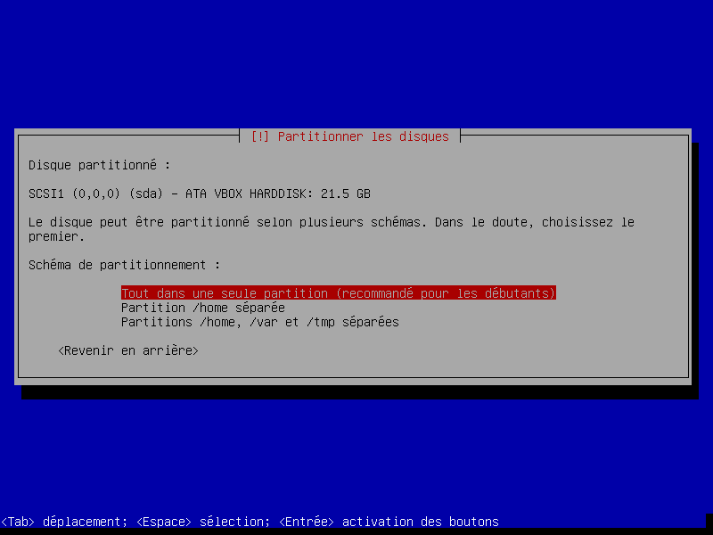
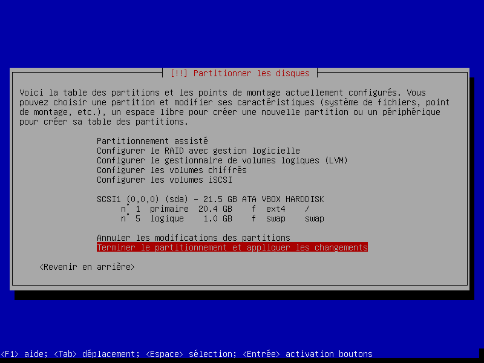

Définition
C'est un logiciel (ou ensemble de logiciels) qui permet de lancer plusieurs systèmes d'exploitation invités sur un seul ordinateur physique, nommé hôte. Le logiciel émule le matériel et les ressources nécessaires (bios, espace de stockage, clavier, souris, carte réseau, ports USB ...), afin que les machines invitées soient bernées et communiquent directement avec le matériel virtuel (en pensant qu'ils ont réellement accès au matériel physique). De façon à rendre la virtualisation plus performante, le processeur et la mémoire centrale ne sont pas virtualisés, ils sont directement disponibles à partir de la machine hôte et partagée par l'hyperviseur.

L'hyperviseur est le cerveau de la virtualisation, il assume quelques rôles:
* Contrôle le UCT (CPU) et la mémoire centrale et les répartis entre les différents OS invités
répartir les ressources du serveur hôte vers les ordinateurs virtualisés.
* Protège chaque machine virtuelle afin d'assurer qu'elle n'interagissent pas sur une autre.

Cette solution permet de faire cohabiter plusieurs systèmes d'exploitation complètement isolés. Ces derniers communiquent entre eux généralement via le réseau. En effet, toutes les machines virtuelles sont munies de cartes réseau virtuelles qui permettent d'échanger des données avec l'extérieur.

Il peut sembler a priori étrange de simuler d'autres machines sur une machine hôte : un système d'exploitation est conçu pour utiliser du matériel qui est entièrement sous son contrôle. La juxtaposition de plusieurs systèmes non conçus pour communiquer entre eux peut faire craindre des inefficacités auxquelles s'ajoute le fait que le processus de virtualisation consomme des ressources.

D'une part, on évite une grande partie de ces inefficacité juste en disposant de disques différents pour chaque système, et d'autre part le coût de la mémoire permet à chacun de ces systèmes de rester résident, et parfois avec de larges sections de code partagées. Par ailleurs, le microcode des processeurs inclut de plus en plus de fonctionnalités qui rendent la virtualisation plus efficace: VT-X/AMD-V permet l'exécution d'une machine virtuelle en mode 64 bits sur l'ordinateur hôte ou VT-D/AMD-Vi permet l'accès très rapide aux ressources IO (Ethernet, accélération graphique, contrôleur de disque), ceci est nommé quelquefois PCI passthrough. Ces options se retrouvent dans le BIOS, cependant, par défaut, c'est désactivé. 

Enfin, il est courant pour une entreprise de disposer d'une quinzaine de serveurs fonctionnant à 15 % de leur capacité, de façon à pouvoir faire face aux pointes de charge sporadiques. Un serveur chargé à 15 % consomme presque autant d'énergie qu'un serveur chargé à 90 %, et regrouper plusieurs serveurs sur une même machine s'avère rentable si leurs pointes de charge ne coïncident pas même en incluant la surcharge de la virtualisation. La virtualisation des serveurs permet aussi une bien plus grande modularité dans la répartition des charges et la reconfiguration des serveurs en cas d'évolution ou de défaillance momentanée (plan de secours, etc.). (Wikipedia)

## Avantages pour le cégep
Le cégep utilise des serveurs virtuels. Ils ont plusieurs ordinateurs qui sont en réalité des serveurs virtuels roulant sur quelques ordinateurs physiques. Voici une liste d'avantages pour le cégep:

* Consolidation de serveur (mieux vaut utiliser un seul serveur à 60% que 3 à 20%) pour une réduction des coûts d'exploitation. 
* Simplifier la gestion des images des ordinateurs, les serveurs pouvant être aisément migrés d'un ordinateur à un autre.
* S'assurer que les mises à jour du système ou des logiciels ne causent aucun trouble avant leur implantation dans le parc informatique.
* Sauvegarde automatisée (à chaque jour, semaine, mois, ... ) de l'image complète du serveur pour revenir à une position antérieure dans le temps, au besoin.
* Test de nouveaux logiciels ou installation de nouvelles fonctionnalités d'un logiciel actuel sur un serveur pour s'assurer que ça n'apporte pas des problèmes (bogues).
* Possibilité de revenir à une version antérieure rapidement suite à un trouble logiciel (bogues).
* Possibilité de migrer le serveur virtuel vers un autre serveur lors de bris physiques.
* Mitiger les effets d'un virus (bon il faudra patcher avant de le rendre en ligne) et j'en oublie sans doute.

Pour un administrateur de système, les avantages des serveurs virtuels sont nombreux et surtout au niveau de la prévention pour une perte de performance matérielle assez faible.

## Avantages pour vous
* Réaliser des travaux sur un autre système d'exploitation sans effacer ou réduire les partitions de votre disque.
* Effectuer des sauvegardes système très facilement (car en réalité un disque système simulé est un simple fichier sur l'ordinateur hôte)
* Modifier la quantité de mémoire, de processeur, de disque ou autres se fait par l'entremise d'une interface simple offerte par le logiciel de virtualisation.
* Testez vos applications sur différents systèmes d'exploitation pour s'assurer de la compatibilité

## Logiciels de virtualisation

En effet, les VM ne vont pas aller se servir directement dans les ressources de la machine hôte, tout simplement, car elles n'ont pas conscience d'être des VM hébergées sur un hôte. Elles vont donc aller prendre dans leurs ressources virtuelles. Et comme n'importe quelle machine physique, une VM aura donc son propre disque dur, sa mémoire, son processeur et ses périphériques, à la différence près que tout cela sera virtuel. (openclassrooms)

Avant de parler des logiciels de virtualisation disponibles, nous devons clarifier un point: les types de virtualisation possible.

Le **type 1**, aussi nommé native, ou bare-metal, l'hyperviseur est chargé au démarrage de l'ordinateur. Il communique directement avec le matériel, permet de procéder directement à l'exécution des requêtes et donne accès aux fonctionnalités avancées du processeur pour l'OS client qui est installé.

Le **type 2**, nommé hosted ou hébergé, est un peu plus lent du par l'idée qu'il doit passer les requêtes aux systèmes d'exploitation qui est utilisé sur la machine. Si les ressources viennent à manquer pour le système d'exploitation hôte, les ressources seront limitées pour le logiciel d'hypervision et les clients en souffriront.

Voyons désormais la liste et les types:

Type 1: KVM (Linux), Xen, VMWare ESX, Oracle VM (Xen), Hyper-V, ...

Type 2: Parallels, VMWare Workstation, VirtualBox, qemu

Pour une question de performance, le type 1 est toujours à privilégier. Cependant pour des tests et des évaluations, type 2 peut être adéquat et surtout plus simple à mettre en place.

Bien que KVM, s'installe sur une distribution Linux uniquement, il permet d'installer plusieurs choix de système d'exploitation différent: Linux, BSD, Solaris, Windows, Haiku, ReactOS, Plan 9, AROS Research Operating System et macOS.

# Installation
Lorsque vous êtes prêt à installer votre machine virtuelle, vous devez trouver l'ISO du système d'exploitation que vous souhaitez installer. Une image ISO est une image d'un disque (CD, DVD, BluRay, Clé USB ou disque dur) sous forme de fichier, créé avec un logiciel de gravure. (commentcamarche)

Exemple d'image disponible sur Internet:

https://www.archlinux.org/download/

http://www.debian.org/distrib/netinst

Celle-ci représente une image qui pourra être chargé lors de lancement de l'ordinateur, comme si nous lançions le démarrage d'un ordinateur avec un CD installable.

Si vous voulez installer une ISO sur une clé USB (et non utiliser un CD), il faut utiliser un logiciel tel que etcher.io pour copier l'image et rendre le USB bootable.

## Guide d'installation debian sur VirtualBox 

En classe vous aurez accès à VirtualBox, vous n'aurez qu'à vous créez une nouvelle machine virtuelle.

Cliquer sur Nouvelle pour en créer une nouvelle ;)

Portez une attention à l'emplacement par défaut. En nommant la machine, celle-ci sera préconfigurée en fonction du OS choisi, essayez avec Debian, Ubuntu, ArchLinux ...

Je vous suggère davantage que le minimum, surtout si vous ajoutez une interface graphique (ce qui est recommandé). VDI par défaut est ok. 

Dynamiquement alloué vs taille fixe fera qu'à la création ce sera plus lent pour le taille fixe, mais à l'exécution toujours plus rapide.

Il est préférable de télécharger au préalable le iso de debian (https://www.debian.org/download), à partir de cet instant, la joie peut réellement commencer.

Cliquer sur stockage

Cliquer sur Vide et choisir le cd bleu au bout de la colonne de droite, choose a disk file et choisissez votre fichier debian*-netinst.iso

Cliquez sur démarrer

J'ai choisi l'installation textuelle (cliquez sur Install), pour bien sentir tout l'agrément d'une installation textuelle.

Choisir la langue

Choisir le nom de l'ordinateur, aucun domaine

Le compte root est un des comptes les plus importants du système, choisissez un mot de passe que vous vous souviendrez, sans quoi, vous ne pourrez plus le configurer / modifier.

Par la suite, vous créez votre compte utilisateur avec lesquels vous ferez la majorité des activités avec l'ordinateur.

EST

Assisté - Utiliser le disque entier : dans la vraie vie, jamais on n'utiliserait ça, mais comme c'est simplement une machine virtuelle ;)

Choisissez le disque approprié (il n'y en a qu'un seul, le choix est difficile)

Tout dans une seule partition

Terminer et appliquer

Et encore! :P

Non

Canada

Laissez lui par défaut

Votre choix

**Se déplacer avec tabulation pour choisir continuer**

Attente ... ...

À la fin vous aurez une question sur GRUB, vous devez l'installer en cliquant sur oui.

et inscrire /dev/sda comme emplacement.

Redémarrez.
