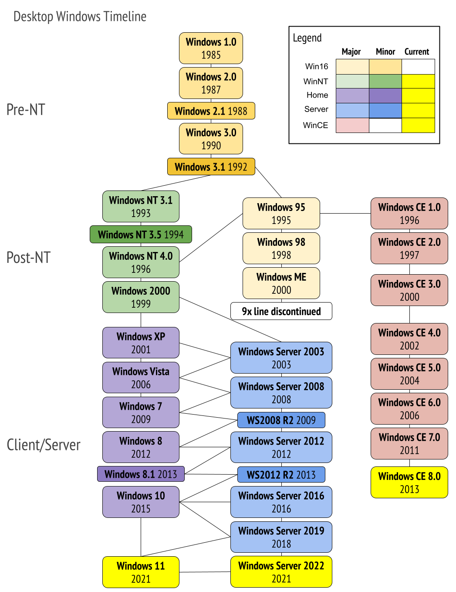
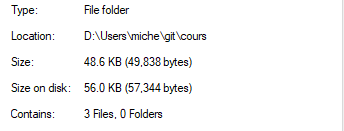

## Disk Operating System (DOS)
En 1980, Digital Research rate ce qui est considéré comme le « contrat du siècle » avec IBM. 1981 est en effet la date de sortie de l'IBM PC, un ordinateur personnel. IBM, convaincu que ce type d'ordinateur serait un échec commercial, décide d'acheter un système d'exploitation plutôt que de le développer. CP/M étant le système d'exploitation alors le plus répandu pour les micro-ordinateurs, on approche Digital Research pour rencontrer Gary Kildall.

Les pourparlers entre Kildall et les représentants d'IBM n'aboutiront pas, ce qui offrira à Bill Gates (de Microsoft) l'occasion de remporter ce marché. Kildall, pour sa part, restera stigmatisé comme celui qui a raté le contrat du siècle. Les principales pierres d'achoppement sur lesquelles on s'accorde sont l'accord de confidentialité et la question des redevances.

Constatant le mécontentement des envoyés d'IBM envers Gary Kildall et Digital Research, et voyant l'occasion de pénétrer le marché des systèmes d'exploitation, Bill Gates se ravise et propose à IBM de fournir un système d'exploitation ; il ira pour sa part le chercher dans une société qui a adapté CP/M sous le nom de 86-DOS.

Après la sortie de l'IBM PC, Kildall examine MS-DOS (Microsoft Disk Operating System) et considère que c'est un plagiat de CP/M. Il menace IBM d'un procès. IBM (qui avait probablement été dans l'ignorance de toutes ces manoeuvres) trouve l'accord suivant : l'acheteur de l'IBM PC pourra choisir d'installer soit MS-DOS (sous le nom de PC-DOS), soit CP/M. Mais PC-DOS est vendu à 40 $ alors que CP/M l'est à 240$ : le choix de l'utilisateur est vite fait.

Ce n'était pas les derniers déboires de Kildall dus à une jurisprudence absente ou imprécise. Il dut volontairement mutiler gravement une de ses créations, Graphical Environment Manager (GEM), parce qu'Apple, qui considérait avoir un copyright sur l'icône de la poubelle par exemple, pouvait intenter des procès sur beaucoup d'autres points.

DOS, que ce soit dans sa version IBM PC-DOS ou dans les versions pour clones MS-DOS, ne comportait pas d'interface graphique. Il était possible avec une grande facilité de créer des graphiques sous le langage BASICA (GW-BASIC pour les clones) livré avec le système, mais les commandes devaient être mémorisées par l'utilisateur et tapées à la main, ce qui rendait le système pénible d'emploi.

Par ailleurs, chaque couple application/périphérique exigeait son pilote générique, ce qui rendait la gestion de ces pilotes compliquée et constituait un frein à l'évolution des configurations.

Inspirées d'interfaces comme celles du Xerox Alto, puis du Apple Lisa et du Macintosh d'Apple, les premières versions de Windows, en 16 bits, s'appuyaient sur l'OS existant : MS-DOS. Celui-ci ayant été conçu monotâche, on y lançait Windows comme un simple programme, qui incorporait dès lors quelques-unes de ses fonctions (comme le tracking de la souris au système). La limitation intrinsèque propre au monotâche, ainsi que le côté marginal de Windows 1 (dont les fenêtres ne faisaient que partager l'écran sans superpositions) n'inquiétèrent pas alors le rival Apple, plus préoccupé de la stratégie d'IBM.

IBM ne pensait pas l'usage du mode graphique viable avec la limitation à 640 K du DOS ni la faible résolution des écrans de l'époque et s'orienta vers un multi-fenêtrage en mode texte, Topview, très réactif, mais gardant l'inconfort du DOS.

La version 2 de Windows (1987) déclencha de la part d'Apple un procès pour contrefaçon. Mais Apple le perdit (en appel) à cause du précédent de l'Alto (contre Digital Research). La firme de la Pomme continua tout de même de menacer Microsoft, ce qui aboutit en 1997 à un règlement à l'amiable : Microsoft produirait Office et Internet Explorer pour Apple et prendrait une part des actions Apple à hauteur de 6%. (wikipedia)

## Windows NT
Windows NT est une famille du système d'exploitation produit par Microsoft. La première version a été disponible le 27 juillet 1993. C'est un système d'exploitation multiprocesseur et multi utilisateur. De plus, il n'est pas dépendant du processeur.

Windows 2000, Windows XP et Windows Server 2003 font tous partie de la famille de systèmes d'exploitation Windows NT. Ce sont tous des systèmes d'exploitation préemptifs, réentrants conçus pour l'architecture x86 d'Intel, aussi bien monoprocesseur que SMP (multi-processeur symétrique). À partir de Windows XP, Microsoft a commencé à inclure le support des processeurs 64-bits dans ses systèmes, auparavant ils étaient basés sur un modèle 32-bits.

L'architecture du système d'exploitation Windows NT est fortement modulaire, et consiste en deux couches principales : un mode utilisateur et un mode noyau. Les programmes et sous-systèmes en mode utilisateur sont limités quant aux ressources auxquelles ils ont accès, tandis que le mode noyau a un accès illimité à la mémoire système et aux périphériques externes. 

L'acronyme NT signifiait New Technology.

Historique des versions



# Windows

## Définition

Un système d'exploitation (SE), souvent appelé OS pour Operating System, est chargé d'assurer la liaison entre les ressources matérielles, l'utilisateur et les applications. Le système d'exploitation permet ainsi de dissocier les programmes et le matériel, afin notamment de simplifier la gestion des ressources et offrir à l'utilisateur une interface simplifiée affranchissant la complexité de la machine physique.

Le système d'exploitation que nous utiliserons pour ce chapitre est Windows 10. Il faut savoir que Windows n'est pas le seul système d'exploitation existant pour PC. Par contre, il est le plus susceptible d'être celui que vous utiliserez dans votre domaine d'étude. 

### Pourquoi ?

Selon ce site: https://gs.statcounter.com/os-market-share/desktop/worldwide, Windows possède 70% du marché de l'ordinateur de bureau / portable. Mais dès qu'on ajoute aux données les tablettes et cellulaires, Windows n'occupe que 40% des ordinateurs devancé par Android: https://gs.statcounter.com/os-market-share.

Alors, pourquoi parler du système d'exploitation Linux dans la technique? Basé sur ce site: https://news.netcraft.com/archives/2022/07/28/july-2022-web-server-survey.html, le marché de Linux pour tout ce qui est web est indéniable. On voit Microsoft sous le 10%, c'est pour cette raison qu'on va passer quelques semaines sur ce système également.

## Éléments principaux de Windows
* Bureau : Écran de démarrage après connexion (desktop en anglais)
* Icônes: Application ou fichiers apparaissant sur le bureau, il s'agit en réalité d'un répertoire qui est affiché (généralement c:\Users\nom_d_utilisateur).
* Barre des tâches: Éléments de l'interface du bureau, permettant de voir les applications préférées et les applications en cours d'exécution, occupant généralement tout le bas de l'écran.
* Bouton Windows: Bouton de la barre des tâches permettant d'obtenir le menu Windows, permettant d'accéder rapidement à l'ensemble des applications de l'ordinateur, plus une liste d'application nécessaire, le menu paramètres et autres portions de configuration de Windows 10.
* Zone de notification: Portion de la barre des tâches présentant des applications roulant en arrière-plan (i-e sans interface graphique).

Vous saviez probablement tout ça, mais pour être certain qu'on le nomme tous ainsi.

### Panneau de configuration

Vestige d'un passé, le panneau de configuration est une porte d'entrée vers la configuration de Windows, sa gestion et ses différentes portions. Il délaisse de plus en plus de points principaux vers le menu Paramètres.

### Menu Paramètres

Nouvelle façon de configurer notre système avec des interfaces très épurées.

## Explorateur Windows
Sous Windows 10, l'Explorateur Windows, accessible par le raccourci Win (touche sur votre clavier) + E, est la façon la plus simple d'accéder aux différents périphériques de mémoire de stockage.  Les trois types de format de système de fichier acceptés (sous Windows) sont les suivants:

* NTFS: système de fichier par défaut, uniquement disponible sur Windows en mode lecture et écriture (sous Linux ce mode peut être écrit, mais pas sur macOS).

* FAT: système permettant d'échanger avec n'importe quel système d'exploitation, mais a une limite de taille de fichier de 4G et d'une limite d'espace de partition de 8 TO (Sur Windows, la limite est de 32GO).

* exFAT: système récent permettant de passer outre les limitances de FAT avec une taille maximale 16 EO et une limite de taille de partition de 128 PO.

### Qu'est-ce qu'un système de fichier?
Cela représente une carte routière pour un disque dur, permettant de déterminer où sont situés les différentes portions d'un fichier. Tous les secteurs (emplacment d'écriture) du disque sont numérotés de 1 à x (le dernier), mais pour pouvoir identifier leur type (fichiers, répertoires, méta-données, lien, ...) et leur hiérarchie, nous utilisons un système de fichier.

Qu'est-ce que ces unités: 16 EO et 128 PO ?

Voyons un tableau de taille d'unité pour nous aider

### Base 10

Noms | Valeur
---|---
bit	| 1 ou 0
octet |	8 bits
kilooctet (KO) |	1000 octets ou 10^3 octets
mégaoctet (MO) |	1000 ko ou 10^6 octets
gigaoctet (GO) |	1000 mégaoctets   ou 10^9 octets
téraoctet (TO) | 	1000 gigaoctets ou 10^12 octets
pétaoctet (PO) | 	1000 téraoctets ou 10^15 octets
exaoctet (EO)  |	1000 pétaoctets ou 10^18 octets
zettaoctet (ZO) |	1000 exaoctet ou 10^21 octets
yottaoctet (YO)	 | 1000 zettaoctet ou 10^24 octets

Cependant, en informatique, nous sommes en base 2, alors vous aurez compris que la table précédente n'est qu'une table d'approximation. En réalité, en 1998, la normalisation des préfixes binaires a eu lieu par la commissions électrotechnique internationale pour nommer les noms. C'est ainsi que les unités sans le i minuscule signifie en base 10, et ceux avec le i minuscule en base 2.

### Base 2
Noms | Valeur
---|---
bit	| 1 ou 0
octet | 8 bits
kibioctet (KiO) | 2^10 octets ou 1024 octets
mébioctet (MiO)	| 2^20 octets ou 1024 Kio
gibioctet (GiO)	| 2^30 octets ou 1024 Mio
tébioctet (TiO)	| 2^40 octets ou 1024 Gio
pébioctet (PiO)	| 2^50 octets ou 1024 Tio
exbioctet (EiO)	| 2^60 octets ou 1024 Pio
zebioctet (ZiO)	| 2^70 octets ou 1024 Eio
yobioctet (YiO)	| 2^80 octets ou 1024 Zio

Donc oui deux tables pour démontrer des quantité de donnée... Cependant, en pensant à ses données, on peut comprendre désormais pourquoi que lorsqu'on achète un disque il est représenter en base 10 car le représenter en base 2 viendrait à devoir créer plus d'octets pour la même quantité:

```
2 MO vs 2 MiO
2 x 10^6 octets vs  2 x 2^20 octets
2 000 000 <  2 097 152 octets
```

Remarquez comment le disque est affiché, 2 MO ou 2 MiO. **On remarque une différence de 5% à peu près**. 

Supposons que vous achetez un disque de 2 TO, voici la différence en octets entre les deux:

```
2 TO vs 2 Tio
2 x 10^12 octets vs 2 x 2^40 octets
2 000 000 000 000 octets < 2 199 023 255 552 octets
```

Désormais, **la différence est presque de 10%**. Que devrions-nous faire alors pour ne pas confondre les gens? 

*Respecter toujours le même standard, toujours y aller en base 10 car les gens sont habitués ainsi. Cependant, sachez que Windows affiche la capacité des disques et la taille comme étant: base 2.*



Ce qu'il faut retenir:

* Windows est en base 2

* Comprendre la différence entre les deux unités de mesure. 

* Il est impossible d'entrer 300 fichiers de 1 GB (sur Windows, donc base 2) sur un disque de 320 GB (base 10), de comprendre pourquoi le disque que vous venez d'acheter, juste en quantité d'espace (avant même que le système de fichier soit installé qu'il est plus petit que ce qu'il est affiché).

# Fichier

Bien que l'explorateur permet de s'occuper de la gestion des fichiers, il faudrait définir parfaitement ce qu'est un fichier.

Un fichier représente une donnée sur le disque : une information numérique constituée d'une séquence d'octets, c'est-à-dire d'une séquence de nombres, permettant des usages divers.  

En vue de faciliter leur organisation, les fichiers sont disposés dans des systèmes de fichiers qui permettent de placer les fichiers dans des emplacements appelés répertoires ou dossiers eux-mêmes organisés selon le même principe de manière à former une hiérarchie arborescente.

Chaque fichier comporte un certain nombre de métadonnées (informations ajoutées par le système de fichier): 
* la longueur du fichier, 
* l'auteur, 
* les personnes autorisées à le manipuler 
* la date de création, 
* ou la date de dernière modification.

## Format
 
Le format de fichier est la convention selon laquelle les informations ainsi que les métadonnées sont numérisées et séquencées dans le fichier. Le format du fichier est propriétaire lorsque la convention n'est connue que de son auteur et n'a jamais été publiée. Le format du fichier est ouvert lorsque la convention est rendue publique en vue de permettre l'interopérabilité des logiciels le manipulant. (wikipedia) 

Exemple de format ouvert:
* texte: csv, json, txt, ...
* images: png, gif, bmp, ...
* vidéos: ogg, mp3, ...
* document: open document format, office open xml, ...

Exemple de format fermé:

* GIF
* ZIP (enfin certaines portions sont publiques, d'autres fermés)
* PSD (photoshop document)
* RTF (document de formattage de texte : Rich Text Format Wordpad)
* DOC (ancien format)
* XLS (ancien format)

## Types de fichier (particulier)
* Binaires: fichiers ne pouvant être facilement lu par un humain. Il est enregistré en format binaire (bits, 1/0),  il permet d'enregistrer des images, vidéos, audio voir même des documents qui doivent être lus par un logiciel particulier.  Voici deux types de fichiers binaires:

   * Exécutable: fichiers exécutables par le système d'exploitation, cela peut être un programme tel que word.exe ou excel.exe, mais aussi des fichiers de script tels que les fichiers batch et les fichiers powershell. Généralement, ce sont eux avec ce genre de logiciel que les utilisateurs interragissent.
  
  * Compressé: fichier codé selon un procédé qui les rend plus légers que les fichiers originaux. Ils sont compressés par un logiciel de compression. Un exemple fort connu est le programme zip. De plus, c'est la seule façon de pouvoir sauvegarder un répertoire complet vers un fichier.

* Texte ou source: Fichiers lisibles par un éditeur de texte, ce sont des fichiers qui ne présentent aucune forme de caractère (contrairement au fichier de traitement de texte). Ce sont généralement des fichiers de configurations. Les fichiers de scripts mentionnés précédemment sont des fichiers textes. La majorité des fichiers de configurations du système d'exploitation Linux sont des fichiers textes.

## Emplacement d'un fichier

Lors de l'écriture d'un fichier, il est traditionnel de le représenter selon sa position et son nom:

```
C:\Windows\win.ini
```

Donc ici, on parle du fichier win.ini situé dans le répertoire Windows (répertoire d'installation par défaut du système d'exploitation Windows). Il n'est pas rare d'omettre la partie C:\Windows si l'on parle d'un fichier situé dans le répertoire en cours, mais nous y reviendrons quand nous verrons la portion DOS.

Analysons les portions de l'emplacement du fichier: 

* C: disque sur lequel se retrouve le fameux répertoire Windows. Sur Windows, les disques représentent une partition où peuvent être stockées les données (il faut cependant que la partition soit dans un format que Windows puisse lire et écrire). Une partition c'est une séparation de l'ensemble des données d'un disque, donc on peut séparer de la mémoire auxiliaire en plusieurs parties.
Il n'est pas rare d'avoir plus qu'une partition dans un ordinateur, cela nous permet de formater par exemple le disque C lors d'une réinstallation de Windows et d'éviter d'effacer le contenu du D: qui conserverait nos données, par exemple. 

* \Windows: même si cela ne transparait pas à première vue, on est dans le répertoire \ (racine) + Windows. Donc à la racine du disque C:\ et on va dans le répertoire Windows.

* win.ini: emplacement du fichier dans le répertoire.

## Métadonnées

Comme dit précédemment les métadonnées sont des données ajoutées dépendant du type de donnée. L'avantage c'est qu'on peut rechercher en utilisant les données stockées dans les métadonnées permettant ainsi d'accélérer nos recherches. Cependant, la présence des métadonnées occupent de l'espace disque:

Voici une liste de métadonnées contenues dans une photo:

* Titre, sujet, évaluation, tags, commentaires 
* Auteur, date de la photo (ne pas confondre avec date du fichier), droit d'auteur, ...
* Camera utilisée (si votre appareil permet d'ajouter cette information aux métadonnées) et caractéristique (temps d'exposition, ISO, grandeur focale, ...) 

Il est possible de faire similaire avec les fichiers Word et autres, chaque fichier de votre ordinateur a des métadonnées rattachées.

## L'extension
En informatique, une extension de nom de fichier (ou simplement extension de fichier, voir extension) est un suffixe de nom de fichier fait pour identifier son format. Ainsi, on dira qu'un fichier nommé exemple.txt a l'extension .txt (ou simplement txt), qui identifie un fichier texte.

Le séparateur fait partie de l'extension et l'extension fait partie du nom de fichier. Le caractère retenu comme pouvant jouer le rôle de séparateur d'extension peut être présent plusieurs fois **éventuellement successives** dans le nom de fichier, seule **sa dernière occurrence** est le séparateur.

Donc le fichier:

fichier.patate.txt.docx

Est un fichier docx car la seule portion importante est la portion .docx à la fin.

Les logiciels ainsi que le système d'exploitation et les usagers utilisent l'extension pour appréhender le format de chaque fichier et l'associer avec un logiciel capable de le manipuler. Toutes les extensions étaient visibles par défaut dans les listes de fichiers depuis les premiers temps du DOS. 

Cependant depuis Windows 95, certaines extensions ( "dont le type est connu." ) sont maintenant masquées par défaut. En contrepartie, l'explorateur affiche à côté du nom de fichier affiche une icône dont le graphisme est censé donner à l'utilisateur humain la même information.

## Limite des fichiers

Nous avons vu précédemment quelques limites fixées par les systèmes de fichier:

Chacun a sa propre convention de noms, comme nous pouvons voir ici pour le système de fichier NTFS:

https://docs.microsoft.com/en-ca/windows/win32/fileio/naming-a-file?redirectedfrom=MSDN#naming_conventions

Voici quelques détails importants:

* Deux fichiers ne peuvent avoir le même nom dans le même répertoire.
* Ne supporte pas les caractères suivants dans le nom: <, >, :, ", /, \, |, ?, * ou le caractère nul.
* De plus, vous ne pouvez utiliser les noms de fichiers suivants: CON, PRN, AUX, NUL, COM1, COM2, COM3, COM4, COM5, COM6, COM7, COM8, COM9, LPT1, LPT2, LPT3, LPT4, LPT5, LPT6, LPT7, LPT8, etLPT9. De plus, ne les utiliser pas pour spécifier un nom de fichier tel que NUL.txt.
* La limite du chemin vers un fichier est 260 caractères si l'option Win32 Long Path n'est pas activée sur votre ordinateur.

## Attributs des fichiers

Le système de fichier NTFS supporte quelques attributs de fichier, ce sont des petites caractéristiques qui affecte la gestion du fichier par le système d'exploitation:

Nom	|Fonction	|Abbréviation
---|---|---
Lecture seule	| Interdire les modifications et les suppressions en DOS. L'explorateur Windows ne s'en soucie pas. | R (Read only)
Archive | Marquer les fichiers créés ou modifiés depuis la dernière sauvegarde | A
Fichier caché | Cacher le fichier (ne s'affiche ni dans l'explorateur de fichier, ni dans le DOS) |	H (hidden)
Fichier système | Fichiers systèmes (fichier primordiaux de Windows qui ne devraient pas être modifié ou effacés) | S
Hors connexion | Identifie un fichier qui n'est pas local (il peut être situé sur Azure ou OneDrive) | O
Non indexé | Le fichier ne sera pas indexé par le service d'indexation de contenu de Windows | I 	I
Répertoire | Répertoire	| D (directory)
Compressé | Indique un fichier ou dossier compressé du système de fichier. Ne peut être encrypté. | C
Chiffré | Indique un fichier ou dossier Chiffré (qui ne peut être lu que par l'utilisateur en cours) | E
Temporaire | Le fichier est indiqué non-permanent. Souvent les utilitaires de backup ne considéreront pas ces fichiers là. | T

Pour voir les attributs, la commande attrib peut être utilisée, nous verrons ça dans le prochain cours lors de notre découverte de DOS.

## Gestion des fichiers

Je ne vous apprendrai rien dans cette section, mais c'est pour que tout le monde sache les termes:

### Souris

* Cliquer / Double cliquer: Appuyer / Appuyer deux fois avec le bouton gauche de la souris sur une icône.
* Clique droit: Appuyer sur le bouton droit de la souris. Permet généralement d'appeler le menu contextuel (dépendamment de l'application et de la position de la souris)
* Pointer: Déplacer le curseur de la souris vers une position donnée
* Glisser: Pointer un objet, cliquer sur le bouton gauche, conserver le bouton enfoncé et déplacé jusqu'à l'endroit désiré (c'est souvent utilisé pour copier / couper / coller des documents).
* Sélectionner: Cliquer sur un icône ou un nom, ce dernier deviendra en bleu.

### Sélection de base avec la souris

Lors du glissement avec la souris:

* Sur le même disque provoque un déplacement
* Sur un disque différent provoque une copie

Lors d'un glissement avec la souris, il est possible de forcer:

* la copie: ctrl
* le déplacement: majuscule
* un raccourci: alt

Lors de la multi-sélection de fichier dans l'explorateur Windows, la touche:

* majuscule: permet de sélectionner une intervalle de fichiers 
* ctrl: permet de sélectionner individuellement les fichiers


### Opérations de base sur les fichiers

Opérations (raccourcis) | DOS | Définition
--|--|--
Renommer (F2) | rename | Sélectionner un objet et cliquer de nouveau sur le nom, vous pourrez le modifier.
Copier (Ctrl-C) | copy | Créer une copie d'un objet à un nouvel emplacement.
Couper (Ctrl-X) | move | Déplace l'objet d'une position X à une position Y dans le système de fichier.
Coller (Ctrl-V) | | Opération finale dans les opérations copier et couper. Ça permet d'effectuer l'opération.
Supprimer (Suppr)| del | Opération qui permet d'effacer le fichier sur le disque. Si vous appuyez sur maj au préalable, le fichier ou dossier supprimé évitera la corbeille, il ne pourra être récupéré ultérieurement. La corbeille est un dossier dans lesquels les fichiers supprimés sont conservés pour éviter une suppression par erreur.
Compresser | zip | Crée un fichier compressé, ceci va permettre d'occuper moins d'espace disque que le fichier original sans y perdre d'information. Tous les forfats de fichiers ne sont pas compressibles, par exemple les images graphiques sont pour la plupart déjà compressées, tout comme les fichiers MP3 et les documents Word (docx). Par contre, un document texte permettra d'en sauver. Sous Windows, dans l'explorateur de fichier, il supporte la compression .zip et la décompression. Sachez que c'est la seule façon de transformer un dossier en un fichier afin d'attacher à un courriel (par exemple).
Lien symbolique | mklink | Un lien est un pointeur vers un autre emplacement du système de fichier, par exemple vous pouvez faire clique droit et envoyer vers -> bureau. Ceci va cliquer un lien du bureau vers le fichier ou le dossier que vous avez cliqué. 

## Raccourcis claviers

Il est recommandé qu'en tant qu'informaticien vous les connaissiez et utilisiez une multitude de raccourci, loin de moi l'idée de les recopier ici, je vais vous donner un lien les montrant de façon générale:

https://support.microsoft.com/fr-ca/help/12445/windows-keyboard-shortcuts

Vous devez connaître ceux de la section Copier, coller et autres raccourcis clavier généraux minimalement.

