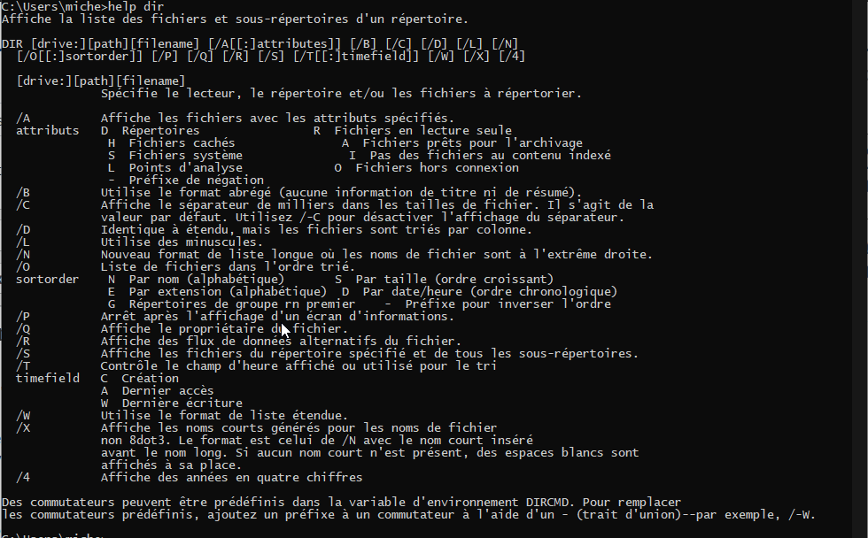
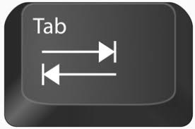
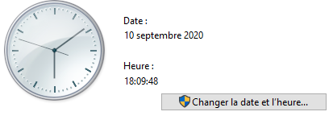

# La ligne de commande Windows

La ligne de commande permet une communication en mode texte entre l'utilisateur et le système d'exploitation. Il est généralement utilisé pour les scripts, c'est-à-dire des fichiers ayant une multitude de commandes avec des tests afin d'effectuer des opérations répétitives.

Nous nous concentrerons uniquement sur la ligne de commande pour aujourd'hui et nous verrons le batch le prochain cours.

# Commandes de bases

C'est une façon de donner un ordre à un système d'exploitation. Par exemple: 

* Liste les fichiers
* Copie un fichier à tel emplacement 
* Déplace ce répertoire vers cet emplacement
* Renomme un fichier

Mais pour ce faire, nous devons respecter une syntaxe, une façon afin qu'il comprenne ce que nous essayons de lui faire réaliser.

La commande **help** vous donne la liste de commande disponible pour l'environnement.

Sachez que sous Linux, le BASH est aujourd'hui le prompt le plus utilisé, et c'est un langage de programmation aussi, donc il supporte les conditions et les méthodes.

### Pourquoi doit-on apprendre les commandes? 

Car il est beaucoup plus simple de naviguer dans un système de fichier que d'ouvrir des fenêtres et de choisir les fichiers manuellement. De plus, sur Linux tout se fait en ligne de commande... du moins à distance.

La commande help liste les commandes disponibles, comment en savoir plus sur une commande? 

**help dir**



Le but **n'est pas** d'apprendre la commande par coeur mais de comprendre comment la lire.

Premièrement, en haut nous avons les diverses possibilités:
* les crochets indiquent un argument facultatif alors que leur absence signifie un argument obligatoire.
* le + signifie qu'il peut y avoir présence de plusieurs fois cet argument
* le | signifie un choix entre plusieurs éléments

En ayant vu cela, on peut comprendre la différence entre:

```
dir
dir c:
dir c:\Users
dir /o:-D C:\Users
dir /w C:\Users
dir /a:h C:\
```


# Relatif ou Absolu

## Chemin absolu

Un chemin absolu vers un fichier est un lien indiquant la position complète du fichier, en intégrant le disque.

```
C:\Windows\win.ini 
```

Ce chemin est absolu, car il débute avec la lettre du disque. Il ne peut pas avoir plusieurs fichiers pointés par ce chemin vu qu'il est absolu.

## Chemin relatif

Un chemin relatif est basé sur la l'emplacement actuel de l'utilisateur dans le système de fichier. Supposons que vous êtes dans le répertoire C:\Windows, le fichier **win.ini** est directement accessible dans le dossier en cours. 

Si vous êtes situé dans le répertoire C:\ (la racine du disque C:) et que vous voulez référencez le fichier win.ini du répertoire C:\Windows, vous auriez rejoint le fichier en utilisant le référencement suivant:  

```
Windows\win.ini
```

On atteint en ordre:
* le sous-répertoire contenant le fichier: Windows
* et finalement le nom de fichier: win.ini

La différence étant que votre "référencement" ne commence jamais par le disque, toujours par l'emplacement actuel où vous êtes situés dans la hiérarchie. 

La majorité des déplacements de façon manuelle sont réalisés au moins en partie de façon relative. La grande majorité des déplacements dans les scripts sont réalisés en absolu, car on ne peut savoir à partir de quel endroit le script sera exécuté. Nous apprendrons à faire du scripting bash au prochain cours.

### Important

* On peut comparer les chemins relatifs à la navigation dans une ville: tourne à droite à la troisième lumière, après tourne à gauche, aux deuxièmes stops, tu es arrivé) alors que l'absolu serait d'utiliser l'adresse physique de la personne pour la retrouver.
  
* Il est important de comprendre que dans les deux cas, il s'agit du même chemin. De plus, à l'examen, je peux vous demander de façon relative ou de façon absolue.

## Dossier parent / actuel

### Dossier parent ..

Si vous êtes situés dans le dossier C:\Users\10101010 et que vous souhaitez accéder au dossier parent qui est le C:\Users, comment feriez-vous?

*La commande pour changer de répertoire est la commande cd.*

* En absolu le dossier serait accessible par: **cd c:\Users**
* En relatif le dossier serait accessible par: **cd ..**

Le .. représente le dossier parent du répertoire en cours. Il est à noter que chaque répertoire n'a qu'un seul parent, mais une multitude d'enfant, donc on ne peut pas accéder à un enfant sans le nommer.

```
cd c:\Users
ou
cd ..
```

Les deux commandes précédentes permettent d'accéder au répertoire c:\Users à partir de C:\Users\10101010. Entre les deux je préfère la deuxième car elle est plus courte à se rappeler. N'oubliez pas que le prompt vous montre votre emplacement en cours.

### Dossier en cours .

Utilisé lorsqu'on copie ou déplace à partir du / ou vers le dossier en cours comme destination.

Supposons que vous voulez faire une copie de différents fichiers vers le répertoire C:\Backup et que vous êtes situés dans c:\Backup.

```
copy c:\Windows\win.in
```

La commande précédent copie le fichier win.in vers la destination : le répertoire en cours. 

Soit la copie du fichier C:\test\patate.txt vers le dossier C:\test2 peut se réaliser de 4 façons distinctes: 

Supposons que vous êtes positionnés dans le répertoire source: C:\test
```
copy C:\test\patate.txt C:\test2\ (absolu)
copy patate.txt ..\test2\ (relatif)
copy patate.txt C:\test2\
copy C:\test\patate.txt ..\test2\
```

## Important

* Rien ne vous oblige de garder la même convention (d'être toujours en absolu ou d'être toujours en relatif), l'important c'est de comprendre la hiérarchie et le référencement pour être en mesure d'effectuer n'importe quelle copie ou déplacement nécessaire.
  
* Lors d'une copie de fichier, il n'est pas obligatoire d'écrire le nom du fichier de destination car s'il n'est pas indiqué, on garde le même nom de fichier. On peut donc utiliser cette syntaxe pour renommer le fichier de destination.


## Auto-Complétion

Les répertoires et nom de fichiers peuvent s'auto-compléter, il est intéressant d'utiliser cette fonctionnalité donnant une aide ponctuelle dans la navigation. Pour ce faire, utiliser la touche tab lorsque vous avez commencé à taper le nom du fichier ou du répertoire (2-3 lettres est l'idéal).



## Gestion des utilisateurs sous Windows

En utilisant les interfaces graphiques, vous pouvez aisément gérer vos utilisateurs sur Windows par l'entremise du Paramètres -> Comptes. Vous pourrez gérer tous les utilisateurs du système, soit par contre professionnel ou scolaire ou les autres (familles et autres utilisateurs).

Les privilèges peuvent se mettre sur un dossier ou un fichier directement. Pour changer les permissions d'un fichier ou d'un dossier (et de tous les enfants), simplement cliquer sur le répertoire, choisir propriété et cliquer sur l'onglet sécurité (deuxième).

Nom | Description
--- | ---
Contrôle total | Donne la permission de lecture, d'écriture, de changement et d'effacement pour le fichier ou dossier en cours et de tous les enfants. Cette permission permet aussi de modifier les permissions pour l'objet sélectionner et ses enfants.
Modification | Donne la permission de modifier le fichier et ses enfants (dans le cas d'un répertoire). Vous pouvez également effacer le fichier ou les enfants.
Lecture et exécution | Permet à l'utilisateur de lire et d'exécuter les fichiers exécutables (tout comme les scripts).
Afficher le contenu du dossier | Permission utile seulement pour les répertoires afin de permettre de voir le contenu d'un répertoire, s'hérite par dossier parent à enfant.
Lecture | Permet de voir le contenu d'un fichier et ses permissions.
Écriture | Permet d'écrire sur le fichier
Autorisations spéciales | Permet de choisir à la pièce les permissions.

icacls est la commande DOS permettant de gérer les droits sur un fichier ou un répertoire.

## UAC
Le UAC est une fonctionnalité ajouté à Windows qui s'assure que vous obtenez les droits d'administration au besoin. Dans le sens que tous les comptes de l'ordinateur s'exécute en tant qu'usager jusqu'au moment où le compte a besoin de plus d'accès.

Le UAC, user access control, s'assurera que vous ayez les permissions afin d'exécuter une requête administrateur. Si vous n'avez pas les droits d'accès nécessaire il vous offrira la possibilité d'entrer un nom d'utilisateur et un mot de passe d'un compte administrateur afin de pouvoir exécuter votre requête. 



Le bouclier représente l'utilisation de UAC, afin de devenir administrateur.

## Mises à jour
Certains types de virus utilisent des failles du système d'exploitation afin de s'y immiscer. Ces failles sont non seulement utilisées par les virus informatiques, mais aussi par les pirates informatiques. C'est pourquoi il est toujours préférable de ne pas utiliser de système d'exploitation dont la date d'expiration est passée (Windows 7, Windows 8).

Les failles s'appliquent autant au ordinateur de type bureau (Windows, macOS, GNU/Linux) qu'aux téléphones cellulaires (android / iphone). 

Windows 10 offre un programme, nous facilitant la tâche, permettant de vérifier les correctifs manquants et de les appliquer. Pour ce faire, allez dans Paramètres -> Mise à jour et Sécurité.

Les actions des pirates informatiques peuvent avoir des conséquences facheuses à la maison mais désastreuses pour une compagnie (vol de données, vol d'information personnelle, effacement des données, demande de rançon). C'est pourquoi, il est recommandé de garder à jour nos logiciels, surtout le système d'exploitation, en leur appliquant les correctifs nécessaires. 

## Firewall

Un pare-feu (de l'anglais firewall) est un logiciel et/ou un matériel permettant de faire respecter la politique de sécurité du réseau, celle-ci définissant quels sont les types de communications autorisés sur ce réseau informatique. Il surveille et contrôle les applications et les flux de données (paquets). 

Sous Windows, avec la venue de Windows XP, un parefeu a été mis en place et est généralement activé par défaut. Il s'assure que les paquets qui arrivent à votre ordinateur vous sont destinés.

De plus, le logiciel Windows Defender Firewall contient une protection contre les malware et l'hameçonnage.

Fait à noter que les parefeux matériels sont largement plus dispendieux que les pare-feu logiciels. Ils procèdent à l'analyse de paquet de façon plus approfondie et le OS d'un hôte ne peut être affecté.

## Nettoyage de disque

Lorsque vous travaillez avec Windows 10, celui-ci utilise beaucoup de dossiers et fichiers temporaires. Il en va de même pour certaines applications telles que Edge qui conservent une copie des pages visitées sur Internet, qu'on nomme la cache Internet ou tout bonnement cache. Ces dossiers et fichiers, à la longue, peuvent occuper de la place inutilement sur vos unités de storage.

Rechercher tous ces dossiers et fichiers manuellement, afin de les supprimer, serait une tâche ardue. Le nettoyeur de disque effectuera cette tâche pour vous. Le cache Internet n'est pas le même pour Chrome, Firefox, il faudra voir dans les paramètres de ces applications.

Vous pouvez le trouver dans le Menu démarrer -> Outils d'administration -> Outils système -> Nettoyeur de disque.

Suite à l'analyse de votre disque dur, celui-ci vous offrira quelques options permettant de spécifier qu'est-ce que vous désirez nettoyer et vous indiquera l'espace total qui sera libéré suite au nettoyage.

## Vérification de disque
Le réparateur de disque de Windows se lance au démarrage lorsque l'unité de stockage présente des problèmes de lecture ou des redémarrages répétés.

La commande Windows CHKDSK (« Check Disk ») permet de s'assurer que, sur un volume donné, le système de gestion des fichiers n'est pas endommagé (et le répare éventuellement), et que les surfaces disque ne sont pas dégradées (bad sector) à certains endroits (et marques ces endroits pour qu'ils ne soient plus utilisés).

Elle crée et affiche un rapport sur l'état d'un disque donné en fonction du système de fichiers. Utilisée sans paramètre, la commande chkdsk affiche l'état du disque placé dans le lecteur en cours.

Il est possible d'accéder à l'outil de vérification lorsque vous ouvrez les propriétés du disque et que vous choisissez Outils.

## Défragmentation de disque
Lors de l'écriture de fichiers sur vos disques, le système d'exploitation recherche un espace libre dans l'espace de stockage aussi grand que la quantité de données qu'il a besoin d'écrire. Si jamais cet espace est introuvable en un seul bloc contigu, le système d'exploitation fragmente ce fichier écrira le fichier sur plusieurs portions de bloc distinctes (non reliées).

Cette fragmentation ne crée pas un dysfonctionnement du système, mais exige du disque dur de se repositionner plusieurs fois lors de la lecture du fichier, occasionnant ainsi un délai de lecture plus long. Lorsque notre système de fichiers comporte des milliers de fichiers fragmentés, ce délai se fait de plus en plus long et peut ralentir le système d'exploitation.

L'outil de défragmentation permettra de rassembler les parties de fichier en un seul bloc permettant ainsi une lecture beaucoup plus rapide de la part du disque dur. Cet outil est trouvable au même endroit que le nettoyeur de disque et n'est pas utilise sur un SSD car le temps d'accès pour un bloc est le même pour l'ensemble du SSD alors que le positionnement sur un disque dur rotatif est très lent par rapport à la lecture de bloc successif.

## Chiffrement de disque

Le chiffrement de lecteur BitLocker est une fonctionnalité de protection des données intégrée au système d'exploitation, qui s'attaque aux menaces que constituent le vol ou l'exposition de données provenant des ordinateurs perdus, volés ou mis hors service de façon inappropriée.

La protection assurée par BitLocker est optimale lorsque ce dernier est utilisé avec un module de plateforme sécurisée (TPM) version 1.2 ou ultérieure. Le module TPM est un composant matériel installé sur de nombreux ordinateurs récents par les fabricants d'ordinateurs à même le processeur.  Il fonctionne avec BitLocker pour protéger les données utilisateur et s'assurer que l'ordinateur n'a pas été falsifié pendant que le système était hors connexion.

Les données stockées sur un ordinateur perdu ou volé sont vulnérables aux accès non autorisés via l'exécution d'un outil d'attaque logicielle contre elles ou le transfert du disque dur de l'ordinateur sur un autre ordinateur.  BitLocker contribue à limiter l'accès aux données non autorisées en renforçant la protection des fichiers et du système. BitLocker permet également de rendre les données inaccessibles lorsque les ordinateurs protégés par BitLocker sont mis hors service ou recyclés.

## Gestionnaire de périphérique

C'est un centre de contrôle pour tout le matériel de l'ordinateur, il permet entre autres de modifier les drivers pour le matériel qui est en cours d'utilisation par l'ordinateur. Il peut être utilisé pour diagnostiquer des problèmes ou pour voir le matériel détecté de l'ordinateur.

### États Possibles

Iĉone | Titre
:-:|---
 | un périphérique de votre ordinateur ne fonctionne pas correctement (que les pilotes n'ont pas été correctement chargé), il est recommandé de rechercher dans les détails du pilotes afin de résoudre le problème.
| périphérique désactivé
 | le mode de gestion automatique du périphérique a été désactivé
 | indique qu'un driver n'a pas été trouvé pour ce périphérique et qu'un compatible a été installé.


## Gestionnaire de disque

Permet de prendre contrôle de votre disque, vous pouvez ainsi voir votre nombre de partition et effectuer des opérations de base sur ces derniers. Il s'agit d'une interface limité mais qui vous permet de faire des opérations de base tel que formater une clé usb en deux partitions et ainsi de suite.

Bien que fonctionnel, son alternative en ligne de commande est beaucoup plus fonctionnel et complet: diskpart. Celle ci vient avec plusieurs commandes disponibles permettant la gestion des partitions Windows de façon plus complète mais en ligne de commande.

## MSConfig

Msconfig, aussi connu avec le sobriquet System Configuration Utility, est un utilitaire Microsoft introduit avec Windows 98 et disponible avec toutes les versions subséquentes de Windows. Il est utilisé avec de configurer choix du OS et les options par défaut si vous avez installer plusieurs versions de MS Windows, de déterminer les programmes et logiciels devant être exécutés au démarrage de Windows.

Vous devez être administrateur pour pouvoir exécuter cette commande.


