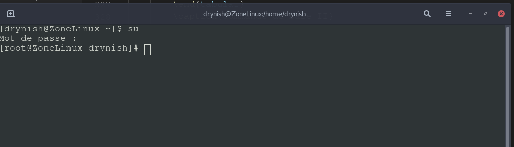
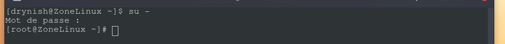
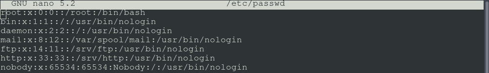
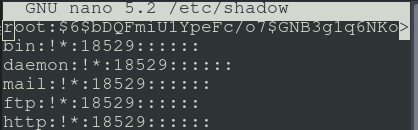
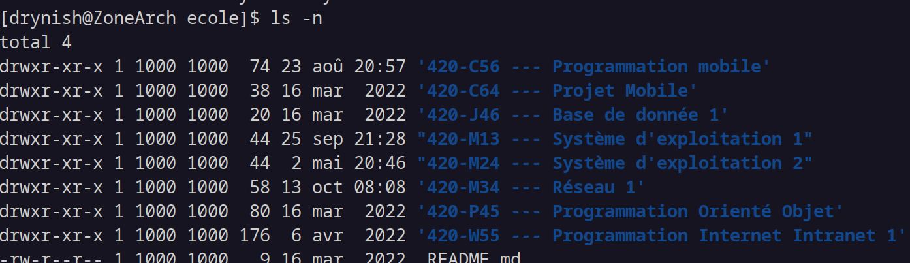
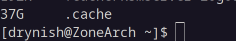

# Administration de GNU/Linux

## Deux niveaux d'accès pour l'ordinateur
* root
* utilisateur

Le niveau le plus élevé sous GNU/Linux est l'administrateur. Il a un accès total sur l'ordinateur, ayant accès à tout: il s'agit du compte root.

Il est recommandé de n'utiliser le compte root que sporadiquement:
* installation ou mise à jour du système (ajouts, suppression paquets)
* gestion des compte (ajouts, suppresssion, modifications)
* gestion de l'ordinateur (modification des fichiers de configurations du système d'exploitation, configuration des services, ...)
* gestion des droits d'accès pour les fichiers (configuration de la racine d'un site web)

*Utiliser le compte root en permanence serait un risque au niveau de la sécurité, car ce compte a accès à tout et tous les droits possibles, alors un script exécuté en tant que root a le droit de tout voir et de tout lire.*

Il est possible d'obtenir les accès root par l'entremise de deux commandes
* su: qui permettait d'obtenir les droits d'accès d'un autre utilisateur. su sans paramètre tente d'obtenir l'accès root, alors que su username, permet d'obtenir l'accès à l'utilisateur username.
* sudo: exécute une commaende x par l'entremise de l'accès root et par la suite, redevient l'utilisateur. Ceci est utilisé aussi pour permettre à certains utilisateurs d'exécuter certaines commandes précises (déléguer des ensembles de commande à un groupe ou un utilisateur).


En tout temps pour quitter le mode root, tapper "Exit" ou cliquer sur Ctrl+D.

## su



Comme vous voyez, l'utilisateur connecté est devenu root et en plus on voit apparaître le # à la fin qui indique que le prompt est en mode super-utilisateur.

Aussi faire attention, pour obtenir une session complète (suite à un login), nous devons utiliser le su - (noter le -).



De cette façon, nous nous retrouvons directement dans le dossier /root en étant utilisateur root. La différence est le -, elle simule le login comme dit précédemment. 

Si vous avez installer Debian sans mot de passe Root, vous pouvez devenir root en tapant la commande suivante:
sudo -i

## sudo

Le fichier /etc/sudoers est rattaché à la configuration de sudo. Par exemple, c'est dans ce fichier que va être déterminé si un groupe pourrait faire la job d'administration et les membres de ce groupes se retrouverait avec la possibilité d'exécuter sudo. Pour que sudo fonctionne, assurez-vous que votre nom d'utilisateur se retrouve dans le groupe "sudo" dans le fichier /etc/group. Pour l'ajouter, éditez le fichier:

```
nano /etc/group
```

Vous aurez probablement à rebooter ensuite.

Sinon on peut permettre certaines commandes à certains utilisateurs, n'hésitez pas à consulter visudo pour éditer le fichier sudoers.

Sachez que par défaut, visudo ouvre vi pour la manipulation de fichier. Si vous souhaitez avec nano:

```
[root@ZoneArch ~]# EDITOR=nano visudo
```

# Gestion des utilisateurs sous GNU/Linux

## /etc/passwd 

Contient la liste des utilisateurs sur un ordinateur Linux. Comme vous le remarquez, il y a plusieurs utilisateurs créés par le système par défaut, généralement les comptes utilisateurs débutent en position 1000. Remarquez également que c'est un fichier texte, la majorité des fichiers sous GNU/Linux sont des fichiers textes qui nous permettent d'avoir plein contrôle sur les données à l'intérieur.

Les différentes colonnes séparées par le caractère : 
* nom d'utilisateur
* mot de passe (vétuste, plus utilisé, pour ça que c'est x)
* le id du compte
* le gid du compte (groupe principal)
* renseignements personnels (noms, prénoms, numéro, ...)
* répertoire personnel
* langage de script utilisé lors de la connexion de l'utilisateur.



## /etc/shadow 

Contient les mots de passes des utilisateurs et les différentes colonnes suivantes:
* nom d'utilisateur
* mot de passe ($6$ signifiant SHA-512) (encryptés)
* Le nombre de jour depuis le 1er Janvier 1970 que le mot de passe a été changé (18529 = 24 septembre 2020)
* Le nombre de jour minimum entre changement de mot de passe
* Le nombre de jour maximum entre changement de mot de passe
* Le nombre de jours avant que l'utilisateur se fasse aviser qu'il doit changer le mot de passe
* Le nombre de jours après l'expiration du mot de passe que le compte devient inactif.
* Le nombre de jours après le 1er janvier 1970 que le compte est désactivé



L'utilisateur root a l'id 0. Les utilisateurs du système ont un ID assigné par le système, c'est ce dernier qui est utilisé dans les permissions du système de fichier:



Pour gérer les utilisateurs du système, nous utilisons les commandes root suivantes:
* useradd: Commande pour l'ajout d'un utilisateur
* usermod: Commande pour modifier un utilisateur
* userdel: Commande pour effacer un utilisateur

## Exemples d'utilisation

### Pour ajouter un utilisateur

```
useradd toto 
```

Ne crée ni le répertoire personnel et n'assigne aucun groupe à l'utilisateur. La configuration de l'utilisateur est à faire au complet. À la place, on pourrait utiliser "adduser" qui est un script qui assiste le processus de création de l'utilisateur (va créer groupe au nom de l'utilisateur, va demander un mot de passe, etc.).

### Bloquer un utilisateur

```
usermod -L toto -e 1
```

### Assigner le groupe principal patate et les groupes supplémentaires rouge, jaune, vert à drynish

```
usermod -a -G patate -g rouge, jaune, vert drynish
```

### Changement de mot de passe

**Si vous êtes administrateur, vous pouvez spécifiez l'utilisateur que vous souhaitez modifier. Sinon, la commande modifie le compte en cours.**

```
passwd
```

# Gestion des groupes

Chaque utilisateur fait également partie d'un groupe primaire et peuvent faire partie d'un nombre illimité de groupe secondaire. La modification des informations de groupe primaire et secondaire d'un utilisateur se fait par la commande **usermod**.

Les commandes de gestions de groupe sont similaires à celle des utilisateurs:
* groupadd: Commande pour ajouter un nouveau groupe
* groupmod: Modification d'un groupe
* groupdel: Suppression d'un groupe
  

Mais où sont les configurations par défauts des logiciels useradd, groupadd et la gestion de l'âge des mots de passe?  /etc/login.defs

id : commande permettant de savoir notre nom d'utilisateur (et son id) ainsi que notre groupe principale et ceux secondaires.

# Gestion des fichiers

La notion utilisateur / groupe est primordiale pour l'accès aux fichiers et aux ressources du système d'exploitation.

Les commandes suivantes sont utiles pour gérer l'accès aux fichiers des utilisateurs sous Linux:
* chown : change le propriétaire d'un fichier
* chgrp : change le groupe d'un fichier

## Exemple d'utilisation

### Change le propriétaire du fichier fichier.txt pour patate.

chown patate fichier.txt

### Change le groupe du fichier fichier.txt pour jaune

chgrp jaune fichier.txt

### Refait les deux dernières opérations en une seule (changement propriétaire pour patate et changement groupe pour fichier).

chown patate:jaune fichier.txt


# Gestion des paquets

Le système de paquet de Debian est l'APT (Advanced Packaging Tool) qui permet de gérer l'installation des paquets (logiciels) et de leurs dépendances. Il permet deux interfaces par défaut aptitude et apt. apt est un utilitaire de ligne de commande alors que aptitude est une interface graphique en curse. Côté interface graphique, il y a le logiciel synaptics.

Commande | Description
---|---
apt-get install paquetage | installation d'un paquetage
apt-cache search sujet | recherche d'un paquet concernant le sujet
apt-get remove paquetage | déinstallation d'un paquetage
apt-get autoremove paquetage |  désinstallation de paquets et de leur dépendances si elles ne sont plus utilisées
apt-get clean | nettoyage du cache des paquets
apt-get update | mise à jour de la version locale de la hiérarchie des paquets
apt-get upgrade | mise à jour des paquets locaux sans installation de nouveaux paquets. 
apt-get dist-upgrade | mise à jour des paquets locaux avec installation de nouveaux paquets ou nouvelles dépendances. 
apt-get install -f | réparation d'une installation brisée
dpkg-reconfigure paquetage | reconfiguration d'un paquet (changer les configurations antérieures)

Ceci n'est vrai que pour une distribution basée sur Debian. Elle ne se gère pas ainsi pour Fedora ni pour ArchLinux. Comme dit précédemment, chaque distribution gère ses paquets de différentes façons.

La grande richesse de Linux se situe ici, ainsi une seule commande nous permet d'installer Firefox tout simplement. Du mode root:

```
apt-get install firefox-esr
```

De façon générale, il installe la dernière version de Firefox disponible pour votre branche. Si vous souhaitez mettre à jour votre système:

```
apt-get update
apt-get upgrade
```

Tous les paquets sont mis à jours automatiquement.

Finalement, le fichier /etc/apt/sources.list et le répertoire /etc/apt/sources.list.d contiennent la liste des différents serveurs auquels le système se connecte pour les mises à jours. C'était une des étapes lors de l'installation d'un système Debian.

# Gestion de système

## Nettoyage de disque

GNU/Linux n'a pas vraiment de solution de nettoyage centralisé, une commande importante permet d'obtenir l'espace disque utilisé: du.

Le seul cache que l'on peut nettoyer automatiquement est celui de la gestion des paquets:

```
apt-get clean
```

Certains programmes peuvent se situer dans le cache du répertoire personnel:

~/.cache

Du répertoire personnel, utilisez la commande suivante:
```
du -h /.cache
```

Le mien sur mon ordinateur actuel à 37 GigaOctets, je viens de l'effacer ;).



## Vérification de disque
Le logiciel fsck permet de vérifier le disque à l'intérieur de Linux. Dans les anciennes versions des systèmes de fichiers, le lancement de fsck était obligatoire après X chargements:

```
fsck /dev/sda1 (partition à vérifier)
```

Fait à noter, il est important d'avoir l'outil de réparation d'installé pour le système de fichier que l'on souhaite vérifier. En gros, il existe un outil de vérification par type de système de fichier: ext2/3/4, NTFS, FAT, HFS, reiserFS, btrfs, jfs, ...

Nous y reviendrons plus tard.

## Défragmentation de disque

Les systèmes de fichiers Linux ne se fragmente pas alors il n'y a pas d'intérêt à faire une défragmentation.