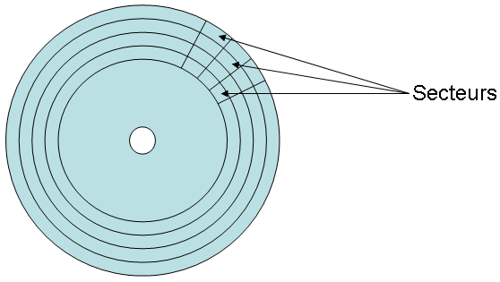

# Unité de stockage

## SSD, disques rotatifs et partitionnement
Les SSDs ont été introduits, il y a maintenant plusieurs années et remplacent progressivement les disques durs rotatifs, mais ils implémentent la même façon de communiquer de façon logicielle que les disques durs.

La liaison entre la carte-mère et l'unité de stockage se fait par le biais d'un connecteur situé sur la carte-mère:
* Serial ATA ou SATA(1, 2, 3) (interne)
* M.2 (interne)
* USB2-3 (externe)

Avec l'apparition initialement d'USB II et dorénavant d'USB III, on voit l'apparition de boîtier externe contenant des disques durs: ce sont des disque dur externe par opposition aux disques durs internes branchés directement sur la carte-maîtresse mais il s'agit du même type de disque à l'intérieur.

Bien que dans la majorité des cas, les disques durs rotatifs ont disparus de nos ordinateurs, ils sont encore présents dans les disques externes et pour offrir des unités de stockage de grande capacité (+ 2TB est dispendieux en SSD).

## Comment fonctionne un disque dur?

Un disque est composé d'un ensemble de disques rigides appelés plateaux. Ils peuvent être en métal, en verre ou en céramique et empiler à une très faible distance les un des autres. Les disques tournent à une vitesse entre 5400 tours par minute pour les ordinateurs portables à 7200 tours par minute pour les disques durs de bureau.


Une tête de lecture / écriture est utilisée pour lire ou écrire les données: celle-ci ne peut que lire ou qu'écrire à un instant précis. Aussi il est à noter que les têtes sont liées les unes aux autres, donc elles sont toutes positionnées aux même endroits lors de la lecture d'une donnée. Le cumul des données sur les différents plateaux s'appelle un cylindre.


Un contrôleur de disque est l'ensemble électronique qui contrôle la mécanique d'un disque dur. Le rôle de cet ensemble est de piloter les moteurs de rotation, de positionner les têtes de lecture/enregistrement, et d'interpréter les signaux électriques reçus de ces têtes pour les convertir en données exploitables ou d'enregistrer des données à un emplacement particulier de la surface des disques composant le disque dur.

[Lien de fonctionnement](https://upload.wikimedia.org/wikipedia/commons/transcoded/c/c5/HardDisk1.ogv/HardDisk1.ogv.480p.vp9.webm)

Le tout est exécuté dans un boîtier hermétique afin de garder les disques hors de contact avec les particules externes, car la moindre particule pourrait détériorer la surface du disque.

Les têtes génèrent un champ magnétique afin de polariser la surface du disque ce qui se traduira par des changements de polarité qui sera alors transférée en 0 et en 1, compréhensible par le contrôleur de disque. Les têtes commencent à l'extrémité du disque et écrivent les données en cercle concentrique, appelées pistes.

Les pistes sont séparées en secteurs entre les deux rayons comportant au minimum 512 octets en général. Le cylindre est l'addition des différents secteurs de chaque étage.





# Notation des secteurs

Dans les premières versions des disques durs, on utilisait une notation CHS pour positionner la tête à un bon emplacement et identifier les secteurs du disque.

## CHS
La notation CHS est une ancienne méthode pour obtenir l'accès à chaque disque physique de données sur le disque dur. En adressage CHS, trois coordonnées sont nécessaires pour accéder à un secteur de disque :

* le numéro de piste (cylindre) ;
* le numéro de la tête de lecture (head) ;
* le numéro du secteur sur cette piste.

Cette notation n'est plus vraiment utilisée même dans le format MBR actuel de représentation des partitions, même si le champs existe. Ce n'est qu'un vestige d'un passé.

## LBA
L'adresse LBA d'un secteur de données est simplement un numéro unique pris dans l'intervalle [0 ... N] où N est le nombre total de secteurs du support. Comme 0 est le numéro du tout premier secteur de données c'est N - 1 le numéro du dernier (et non pas N qui est le nombre total de secteurs).

# Le SSD
Un SSD est matériellement plus résistant qu'un disque dur ; en effet, les plateaux de ces derniers sont de plus en plus souvent en verre depuis 2003, mais surtout, du fait que cette technologie implique l'interaction mécanique entre éléments de stockage (plateaux) et éléments d'accès (têtes de lecture/écriture), des chocs même légers peuvent entraîner des égratignures de la surface magnétique, ou une détérioration des éléments d'accès, donc des pertes de données voire une panne définitive. A contrario, les SSD sont dépourvus d'éléments mobiles, ce qui leur confère une résistance aux chocs et aux vibrations bien supérieure. Les SSD surclassent par ailleurs les disques durs au niveau des performances (débit, latence négligeable, consommation électrique).

Néanmoins, les SSD ont aussi des inconvénients par rapport aux disques durs :

* les puces de mémoire flash ont un nombre limité de cycles d'écriture, ce qui fait que l'ensemble de l'unité a une capacité limitée en termes de volume total de données écrites. Les disques durs n'ont pas cette limitation a priori : si le substrat magnétique est de bonne qualité il peut être réécrit pratiquement à l'infini. Même si l'évolution de la technologie tend à réduire l'impact concret de cet inconvénient dans le cadre d'une utilisation conventionnelle , cela fait que les disques durs restent mieux adaptés aux tâches impliquant l'écriture constante de gros volumes de données (par exemple : serveurs de sauvegarde, vidéosurveillance). (Wikipedia)
* le coût plus élevé pour une même quantitée de données.

# Représentation d'un secteur


| Nom                    | Définition                                                                                                                                                                                                    |
| ---------------------- | ------------------------------------------------------------------------------------------------------------------------------------------------------------------------------------------------------------- |
| gap                    | petit espace blanc: laissant à la logique du contrôleur de disque une zone inutilisée de cette piste permettant le temps nécessaire au basculement du mode lecture au mode écriture et inversement            |
| zone servo             | Contient des informations permettant de synchroniser la logique du contrôleur de disque avec les données qui vont défiler                                                                                    |
| ID (numéro du secteur) | Permet au contrôleur du disque de déterminer le numéro de secteur que la tête de lecture va lire juste après et par là de déterminer également si le bras portant les têtes est positionné sur la bonne piste |
| Données                | La donnée stockée par l'utilisateur                                                                                                                                                                           |
| Somme de contrôle      | Permet de détecter/corriger des erreurs et de mesurer le vieillissement du disque dur                                                                                                                         |

# Blocs du système de fichiers
Les systèmes de fichiers exploitent des blocs (cluster en anglais) qui sont un regroupement de 1 à plusieurs secteurs. Il s'agit aussi de l'emplacement minimal sur lequel un fichier peut être écrit et on choisit la taille des blocs lors du formatage de votre partition.

Dépendamment de la taille de la partition, une rèlge s'impose: plus notre partition à formater est grande, plus la taille des blocs sera grande car nous avons toujours accès approximativement au même nombre total de bloc référencé. Vu que le nombre de bloc est constant, on peut uniquement jouer sur la taille de chacun en modifiant le nombre de secteurs que l'on place dans un bloc. Inversement, plus notre partition est petite, plus nos blocs pourraient être petits.

Plus qu'on réduit la taille des blocs, plus un gros fichier prendra alors plus de bloc pour être lu (ce qui avec les SSD ne devraient pas avoir un impact majeur) .
Idem de l'inverse, si on a un fichier occupant quelques octets, il occupera l'ensemble du bloc.

## Exemple

Ouvrez un document, entrez trois caractères et sauvegardez le sur le disque. Ouvrez ses propriétés, il occupe 0 octet sur le disque, car il sera écrit directement dans le système de fichier.


Remplissez le de 864 caractères (très importants d'être précis). Il occupera beaucoup plus que le 864 caractères.


Comme vous pouvez le constater, mon fichier occupe 864 octets par contre, sur le disque, il occupe un espace 4 KiO.

Je peux donc affirmer en toute sérinité que ma taille de bloc est de 4K sur cette partition.

Le seuil de taille auquel un fichier sera écrit sur le système de fichers ou sur le disque dépend des paramètres du système de fichier.

# Les partitions
Une partition est la façon de segmenter le disque, de le découper en morceaux.

Cela nous permet donc d'avoir par exemple:

* Une partition EFI (Extensible Firmware Interface) (obligatoire avec GPT lors du démarrage, nous y reviendrons dans le chapitre sur le démarrage de l'ordinateur), où GPT = GUID Partition Table.
* Une partition système (c:\Windows ou / pour Linux)
* Une partition pour les données utilisateurs (/home pour Linux)
* Une partition de partage avec Windows (ExFat ou FAT32) pour un système en dualboot (Deux systèmes d'exploitation sur le même ordinateur qui est déterminé au démarrage de l'ordinateur)

Un avantage est de séparer les données et les applications, permettant ainsi à un formattage annuel de Windows en protégeant vos données personnelles situées sur une autre partition.

L'autre avantage est de pouvoir installer deux systèmes d'exploitation sur le même ordinateur, permettant de tirer profit d'un poste de travail Linux, car il faut se l'admettre, en virtuel, c'est un peu lent. Cela vous permet de séparer votre ordinateur lorsque vous devez travailler et lorsque vous voulez jouer.


## Représentation des partitions sous Linux

Sous le système Linux, les différentes partitions sont détectées par le noyau et présentées dans le répertoire /dev:

```
/dev/sda 
```

représente le premier disque détecté

Suite à la lettre, les partitions sont numérotées de 1 à x après le disque

* /dev/sda1 représente la première partition du disque 1.
* /dev/sdb3 représenterait la 3ième partition du disque 2.

### /etc/fstab

Le fichier /etc/fstab, représente les points de montage, spécifiant l'emplacement où les partitions seront rattachés dans le système de fichier du système.
 
Il est noter que la partition racine (/) est monté par l'entremise du système de chargement du système d'exploitation et est déjà chargée lorsque le fichier fstab est lu.

Il n'y a pas d'ordre prédéfini obligatoire de détection de disque. Donc en réalité, à un démarrage donné, le disque 1 pourrait devenir le disque 2, c'est pour cette raison que dans le fichier fstab (le fichier de gestion des points de montage), on utilise le UUID.

# Partitionnement

## MBR

Le MBR (master boot record) est le premier secteur d'un disque dur. Il est donc généralement de 512 octets. Il y a deux types de partitions:

* Primaire
* Étendue

On peut avoir au maximum 4 partitions et au maximum 1 partition étendue. Cependant, une partition étendue ne peut pas stocker de fichiers. Elle est en fait un contenant à partitions logiques qui elles peuvent stocker des fichiers. L'avantage de la partition étendue c'est qu'on peut avoir un grand nombre de partitions logiques. 

Plusieurs informations sont stockées dans la table de partition:
* le statut (bootable, ...) --- 1 octet
* la position de début (têtes, secteurs, cylindres) --- 3 octets
* la position de fin (têtes, secteurs, cylindres) --- 3 octets
* le type de partition\footnote{ext2, ext3, ext4, ntfs, reiserfs, fat, fat32, xfs, \ldots} --- 1 octet voir http://en.wikipedia.org/wiki/Partition_type
* la taille en secteurs --- 4 octets

Le type de partitionnement MBR est toujours utilisée dans les clés USB, les cartes SD et autres appareils ne nécessitant pas l'utilisation de GPT.

## GPT

Une table de partitionnement GUID, en anglais GUID Partition Table (GPT) est un standard pour décrire la table de partitionnement d'un disque dur. Bien qu'il fasse partie du standard UEFI, il est aussi utilisé sur certains BIOS à cause des limitations de la table de partitionnement du MBR qui limite la taille des partitions à 2,2 To (241 octets).

GPT gère les partitions jusqu'à 9,4 Zo (9,4 trilliards d'octets).

La table de partitionnement du MBR date du début des années 80. Dès la fin des années 90, les limitations qu'elle impose sont apparues trop contraignantes pour le matériel modernes. Intel a alors développé un nouveau format de table de partitionnement faisant partie du UEFI. La GPT en étant un sous-ensemble.

* L'adresse LBA, Logical Block Adressing, d'un secteur de données est simplement un numéro unique pris dans l'intervalle [0 ... N] où N est le nombre total de secteurs du support. Comme 0 est le numéro du tout premier secteur de données c'est N - 1 le numéro du dernier.
* En mode GPT, l'information concernant la table de partitionnement est stockée dans un entête GPT, mais pour garantir une compatibilité, GPT maintient aussi une entrée MBR suivie de l'entête d'une partition primaire, le véritable début de la table de partitionnement.

GPT offre aussi de la redondance en écrivant l'entête et la table de partitionnement au début et à la fin du disque.

Comme les MBR modernes, GPT utilise l'adressage logique des blocs (LBA) et non l'adressage historique CHS (cylinder-head-sector). Les informations du MBR sont à l'adresse 0 (LBA 0), l'entête GPT se trouve à l'adresse 1 (LBA 1), et la table de partitionnement en elle-même suit à partir de l'adresse 2 (LBA 2). Sur les versions 64- bit de Windows, le système d'exploitation réserve 16 384 octets (ou 32 secteurs) pour la GPT, le premier secteur utilisable du disque se trouve donc à l'adresse 34 (LBA 34).


Voir wikipedia

# Chiffrement
Plusieurs utilitaires sont disponibles afin d'encrypter un disque, une partition, un fichier, ...  LUKS, pour Linux Unified Key Setup, est le standard GNU/Linux pour le chiffrement des disques.

Une partition chiffrée est chiffrée via une clé, clé qui est générée lors de la création de la partition chiffrée et qui est protégée par un mot de passe (appelée phrase secrète).

LUKS a la particularité de supporter de multiples clés pour un même volume chiffré (ce qui permet de partager un accès sans divulger sa propre clé et/ou son propre mot de passe, de créer une clé/mot de passe de secours, …).