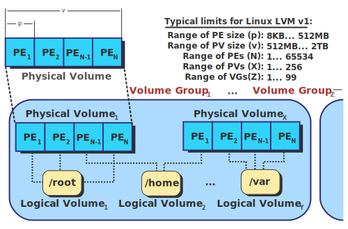

# LVM

La gestion par volumes logiques (en anglais, logical volume management ou LVM) est à la fois une méthode et un logiciel de gestion de l'utilisation des espaces de stockage d'un ordinateur. Il permet de gérer, sécuriser et optimiser de manière souple les espaces de stockage en ligne dans les systèmes d'exploitations Unix.



Pour se faire il faut comprendre 3 caractéristiques principales: 

## Volumes physiques PV
Les disques durs, les partitions de disques durs, volumes RAID ou unités logiques provenant d'un SAN forment des « volumes physiques » (physical volumes ou PV).

## Groupes de volumes VG
On concatène ces volumes physiques dans des « groupes de volumes » (volume groups ou VG). Ces VG sont équivalents à des pseudo-disques-durs.

## Volumes logiques LV
Des « volumes logiques » (logical volumes ou LV) sont alors découpés dans les groupes de volumes, puis formatés et montés dans des systèmes de fichiers ou utilisés en tant que raw devices.

Avant d'utiliser LVM, il faut partitionner les disques en type LVM.

Ensuite,

* Pour les volumes physiques : pvcreate, pvresize, pvscan, pvs, pvdisplay, pvremove, pvmove, pvchange
* Pour les groupes de volume : vgcreate, vgdisplay, vgscan, vgs, vgck, vgremove
* Pour les volumes logiques : lvcreate, lvmdiskscan, lvs, lvdisplay, lvremove, lvextend
* Pour la sauvegarde/restauration de la structure LVM: vgcfgbackup, vgcfgrestore


# Système de fichier 
Le système de fichier est la façon de disposition logique de storer et d'organiser les données sur une partition donnée. Sans lui, nous aurions des données sans savoir où commence le fichier et quand il se termine. Le but d'un système de fichier est de gérer ses blocs afin de s'assurer que les fichiers et répertoires soient bien constitués. Le formatage est l'opération d'écrire un système de fichier vide sur une partition. En fait, il n'est pas totalement vide, il est simplement constitué de la structure du système de fichier.

On se rappelle que la plus petite portion de donnée sur un disque dur pour un système de fichier est un bloc composé d'un ou plusieurs secteurs d'un disque dur occupant généralement 512 K.
Il y a une grande liste de système de fichier existant, certains plus anciens comme FAT32 (FAT a été créé en 1977 mais FAT32 en 1996 avec la version Windows 95) et d'autres très nouveaux comme APFS (Apple File system en 2017), chacun ayant ses particularités.

https://fr.wikipedia.org/wiki/Syst%C3%A8me_de_fichiers

Il est important de comprendre que chaque système de fichier a ses particularités et il est plus aisé de parler d'un système de fichier libre (où on a accès à la documentation) qu'un fermé tel que NTFS et APFS.

## Fonctionnalités de base d'un système de fichier

### Gestion de l'espace disponible

Rôle principal d'un système de fichier d'assigner les fichiers dans un espace de stockage assez grand pour le fichier. Pour ainsi diminuer la fragmentation.

### Gestion des noms de fichiers

Règles afin d'écrire le nom des fichiers tel que caractère permis et nombre de caractères

### Gestion des répertoires

Permet au fichier d'être classé selon des ensembles.

### Gestion des métadonnées

Permet d'associer diverses informations avec les fichiers: nom de fichier, la longueur, nom de l'utilisateur, nom du groupe, permissions, attributs, date de création / modification et emplacement du fichier.

### Utilitaires
* Créer / lister / renommer / effacer des répertoires et fichiers
* Gestion de la défragmentation
* Libération d'espace (dans le cas de fichier effacé)
* Gestion des accès (permissions, ACL)
* Permettre ou non l'accès au contenu d'un fichier

### Gestion de l'intégrité

La structure du système de fichier doit rester intégrale: que ce soit un programme qui plante ou un un programme qui n'avise pas qu'il a terminé son activité. Ceci peut inclure l'exécution d'opérations qui ne se sont pas encore produites sur le système de stockage.

Le système doit également être en mesure de réparer les structures du système de fichier (fichiers, répertoires, métadonnées) dans le cas d'une mise hors-tension non attendue.

### Gestion des données

La notion la plus importante des système de fichier est de permettre la gestion des données des fichiers. Ceci inclut l'enregistrement, la recherche et l'affichage des données.

### Accès par API

Permettre l'accès par un API qui permet au programmeur de pouvoir programmer des programmes afin d'accéder à la structure du système de fichier, de lire / modifier les méta-données et/ou les données.

### Rétro-compatibilité

Les versions nouvelles doivent supporter les anciennes versions du système de fichier. Par exemple, EXT4 supporte EXT3 et EXT2.

## Fonctionnalités avancées de certains systèmes de fichiers

### Chiffrement
Une forme d'encryption qui permet de chiffrer la portion données de chaque fichier dans le système de fichier. Ce n'est pas identique à l'encryption de disque.

### Compression
Permet de compresser la portion des données, donc le système de fichier a plus d'espace, mais chaque lecture / enregistrement occasionne une décompression / compression.

### Journalisation
Conserver les transactions en attente dans un journal avant de les inscrire sur le disque. Comme ça, si une transaction ne peut s'effectuer à cause d'une panne (shutdown), elle s'effectuera au redémarrage.

### COW
Le Copy-on-Write est une stratégie d'optimisation qui permet d'obtenir un pointeur vers un fichier et tant que le fichier n'est pas modifié et enregistré, la nouvelle ressource n'est pas créée. Lorsque qu'on tente de modifier le fichier, il obtient une réelle version et c'est celle-ci qui sera sauvegardée.

### Snapshots
Il s'agit d'une particularité de certains système de fichier qui permet de reproduire une version du système de fichier à un instant précis et permet donc de revenir dans le temps­ au besoin si un fichier est effacé par mégarde.

### Quota
Il s'agit d'une façon de limiter l'espace disque par utilisateur au sein du système de fichier.

### RAID
Il s'agit d'une fonctionnalité de virtualisation des données permettant de répliquer les données sur plusieurs disques afin de permettre une tolérance aux pannes.

### Redimensionnement à chaud

Permet de modifier les tailles des partitions à chaud à l'intérieur d'un système de fichier. La majorité du temps lorsque vous jouez avec les partitions, il est recommandé de le faire lorsque le système d'exploitation n'est pas en exécution (différence entre à chaud et à froid).

### Somme de contrôle

Permet d'ajouter une somme de contrôle aux données ou métadonnées afin d'assurer leur intégrité.

Si vous voulez encore plus de détail, n'hésitez pas à consuler cette page pour encore plus de possibilités: https://en.wikipedia.org/wiki/Comparison_of_file_systems

## Choix du système de fichier

Un des critères importants pour l'utilisation d'un système de fichier est déjà déterminé par le système d'exploitation utilisé: 

### Windows

* NTFS
* FAT
* EXFAT

### GNU/Linux

* ext2/3/4
* btrfs
* xfs
* zfs
* minix (et oui vous avez bien lu)
* cramfs

### Apple 
* APFS
* Mac OS Étendu (journalisé / Encrypté / Case-sensitive)
* FAT32 ou ExFAT

### Unix (FreeBSD, OpenBSD, NetBSD): 
* UFS
* FAT32
 
### Android:
* yaffs
* FAT32
* Ext3/4

### Mémoire flash (carte sd)
* yaffs
* jffs2

Comme vous le voyez, en partant votre système d'exploitation joue un grand rôle, d'autres fois c'est le type de l'unité de stockage, par exemple, sur une clé USB, vous la voudrez sans doute en ExFAT ou en FAT32 afin de pouvoir l'utiliser dans le plus grand nombre de système d'exploitation possible. Tout comme yaffs est un excellente système pour les cartes SD dans les android afin de permettre une longue durabilité et fiabilité de la carte SD.

Si vous installez un système d'exploitation comme Linux, prenez le temps de choisir le système de fichier que vous voulez, car une fois le système installé, il est seulement possible de repartir à neuf en formatant de nouveau la partition et en perdant ainsi les données.

# Introduction à EXT4

Dans le monde EXT4, il y a des inodes et des structures de répertoires pour stocker toutes les méta-données des fichiers pour chaque fichier et chaque répertoire. Ceci permet d'obtenir les méta-données que ce soit le noyau, les applications utilisateurs ou les utilitaires linux tel que ls, stat et df.

## Fonctionnement

Le superblock du système de fichier sont les méta-données du système de fichier:

* nombre total d'inode,
* nombre total de bloc
* nombre de bloc libre
* nombre d'inode libre
* l'état du système de fichier
* les différentes données d'état (dernière fois montée, dernière fois écrit, ...)

https://ext4.wiki.kernel.org/index.php/Ext4_Disk_Layout

Les inodes sont les structures d'information (méta-données) concernant les fichiers. Ce qui est important de se rappeler ici c'est que tout sur les systèmes d'exploitation GNU/Linux sont des fichiers (fichiers, répertoires, devices, ...). Ceci ne contient pas les noms de fichiers, ce n'est que les méta-données des fichiers. Ils contiennent également des pointeurs vers les blocs de données du système d'exploitation.

Voici les informations principales des inodes:
* permission (protection)
* propriétaire
* groupe
* taille
* Date de dernier accès
* Date de dernière modification
* Date de dernière modification des inodes

Les **dentries** (directory entries) sont les structures d'information qui relient les noms de fichier, les inodes et le répertoire parent.

Vous pouvez faire afficher le numéro des inodes en faisant tout simplement un ls:
```
ls -lia ~
```

~ représente le home de l'utilisateur. Permet de voir tous les inodes pour le répertoire en cours, vous pouvez même voir les inodes du répertoire . et ..

Si vous effectuez :
```
ls -lia /home
```

Vous voyez dorénavant que les répertoires . et .. ne pointent pas toujours au même inode, ils pointent à des inodes différents.
La commande stat vous permet de voir l'information stockée dans les inodes.

Vous obtenez ainsi les différentes informations: nombre de blocs, taille des blocs, le numéro de inoeud, le nombre de lien vers les données, les droits d'accès, les dates importantes, ...
